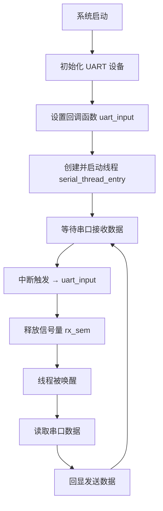

# RT-Thread入门学习笔记分享

​	前言：在学习了51单片机，stm32以后，逐步对裸机开发的方式有了了解，裸机开发简单粗暴，也是最适合新手入门学习嵌入式的一种开发方式，笔者在参加了西门子嵌入式的时候接触到了一点点基于裸机开发的调度器开发，我习惯于把他叫做高级一点的裸机开发，当时只是接触了一点点任务调度器，觉得蛮有意思，在暑假参加完电赛以后，想着趁此机会，趁热打铁学习一下实时操作系统，此笔记也是作为学习分享，一定有非常多需要改正的地方，欢迎各位一起探讨，一起体验嵌入式 的魅力。本笔记是基于西门子嵌入式开发板的GD32F429VE进行的。

## RT-Thread第一个程序-线程

1.打开RT-Thread官方IDE


2.新建一个新的文件


3.选择芯片，选择路径，打开串口1，使用DAP烧录


4.得到此界面，看到有主函数，cubemx配置


5.点击上方Cubemx，开始配置

配置时钟，配置串口


6.配置完成以后，可以看到下面有一个Cubemx的文件


7.可以看到有两个main.c，但是不会冲突


原因：

1. **RT-Thread Studio与STM32CubeMX的整合模式：**
    当您在RT-Thread Studio中使用CubeMX生成代码时，通常会将CubeMX作为RT-Thread项目的一个配置工具。CubeMX会生成一套完整的HAL库初始化代码，其中包括一个它自己的 `main.c` 文件（位于 `cubemx/Src/main.c`）。这个 `main.c` 文件包含CubeMX生成的 `int main(void)` 函数以及各种外设的 `MX_Init` 函数调用。

2. **两个 `main.c` 的角色：**

   - **`application/main.c` (RT-Thread 应用程序入口):** 这是RT-Thread项目的真正应用程序入口点。它通常包含RT-Thread的 `main` 函数，负责系统初始化（包括调用CubeMX生成的初始化函数）、创建任务、启动调度器等。您的大部分业务逻辑代码会在这里或由它调用的其他文件中实现。
   - **`cubemx/Src/main.c` (CubeMX 生成的原始入口):** 这个文件是CubeMX独立生成时的原始入口。它也包含一个 `int main(void)` 函数。

3. **为什么没有冲突？——构建系统的工作：**
    冲突之所以没有发生，是因为RT-Thread Studio的**构建系统（通常是基于SCons或Makefile）被配置为只编译和链接 `application/main.c`，而忽略或不编译 `cubemx/Src/main.c`**。

   - **排除编译：** 最常见的情况是，`cubemx/Src/main.c` 文件被明确地从项目的编译列表中排除。这意味着虽然文件存在于项目目录中，但构建工具（编译器和链接器）根本不会去处理它。
   - **代码移植与调用：** 虽然 `cubemx/Src/main.c` 本身可能没有被编译，但其中由CubeMX生成的**外设初始化函数**（例如 `MX_GPIO_Init()`, `MX_USART1_UART_Init()`, `SystemClock_Config()` 等）的代码是至关重要的。在RT-Thread Studio生成的项目中，这些函数通常会被**复制到或由 `application/main.c` (或 `board.c`) 文件中的 `main` 函数或者 `rt_hw_board_init()` 函数调用**，以完成硬件的初始化。

   从您的项目结构图来看，`application/main.c` 是在 `application` 目录下，并且在项目浏览器中可见。而 `cubemx/Src/main.c` 也在 `cubemx/Src` 目录下。您打开并编辑的通常是 `application/main.c`，这也是您编写应用代码的地方。

**总结来说：**

两个 `main.c` 文件存在，但只有 `application/main.c` 文件及其包含的 `main` 函数会被编译和链接到最终的可执行文件中。`cubemx/Src/main.c` 文件要么被构建系统直接忽略，要么其内部的 `main` 函数被条件编译宏禁用，其主要作用是作为CubeMX生成初始化代码的容器。RT-Thread的构建系统会将必要的初始化函数从CubeMX生成的代码中提取出来，并在RT-Thread自己的启动流程中调用。

### 书写第一个程序代码-打印

代码

```
* 创建线程示例 /
static rt_thread_t tid1 = RT_NULL;

static void thread1_entry(void* parameter)
{
		int count = 0;
		while (1)
	{
		rt_kprintf("Thread 1 is running, count: %d\n", count);
		count +;
		rt_thread_mdelay(1000); / 休息 1 秒
	}
}

int main(void)
{
 * 创建线程 1 /
	tid1 = rt_thread_create("thread1",
	thread1_entry, RT_NULL,
	1024, 20, 10);
	* 启动线程 /
		if (tid1 != RT_NULL)
	{
		rt_thread_startup(tid1);
	}
	return 0;
}
```


下载程序


打开串口助手,观察现象，每秒打印一次


### 这个线程是怎样工作的？

1.创建一个线程，这个线程是结构体rt-thread


rt-thread结构体的参数很多，原因：

`rt_thread` 结构体确实包含了很多参数。这体现了RT-Thread作为一款成熟的实时操作系统（RTOS）对线程进行全面管理和控制的需要。

这些参数的设置是为了满足实时调度、资源管理、同步通信、错误处理以及不同应用场景（如多核、信号、模块化等）的复杂需求。下面我将这些参数进行分类，并简要解释它们的作用：

1. **基本信息和对象管理 (`rt object` 部分)**
   - `name[RT_NAME_MAX]`: 线程的名称，用于调试和管理。
   - `type`: 对象类型，标识这是一个线程对象。
   - `flags`: 线程的各种属性标志，例如是否是动态创建、是否需要清理等。
   - `list`: 用于将线程链接到全局对象列表中。
   - `tlist`: 用于将线程链接到各种线程状态（就绪、挂起等）链表中。
   - `module_id` (如果 `RT_USING_MODULE` 开启): 用于模块化（LWP）管理，关联线程所属的模块。
2. **栈和执行上下文 (`stack point and entry` 部分)**
   - `sp`: 栈指针，保存线程切换时的CPU寄存器信息，是线程上下文的核心。
   - `entry`: 线程的入口函数地址，即线程开始执行的地方。
   - `parameter`: 传递给线程入口函数的参数。
   - `stack_addr`: 线程栈的起始地址。
   - `stack_size`: 线程栈的大小。
3. **状态和错误处理**
   - `error`: 线程最近一次操作的错误码。
   - `stat`: 线程的当前状态（例如：初始化、就绪、运行、挂起、阻塞、退出）。
4. **调度和优先级**
   - `current_priority`: 线程当前的优先级。
   - `number`, `high_mask`, `number_mask` (如果 `RT_THREAD_PRIORITY_MAX > 32`): 用于高效的就绪线程查找算法。
   - `init_tick`: 线程初始化时的系统时钟节拍数。
   - `remaining_tick`: 线程在当前时间片中剩余的节拍数，用于时间片轮转调度。
5. **多核支持 (SMP, 如果 `RT_USING_SMP` 开启)**
   - `bind_cpu`: 线程绑定到的CPU核心（如果支持）。
   - `oncpu`: 线程当前正在哪个CPU核心上运行。
   - `scheduler_lock_nest`, `cpus_lock_nest`, `critical_lock_nest`: 用于嵌套锁计数，管理多核环境下的调度器和CPU锁定。
6. **事件集 (如果 `RT_USING_EVENT` 开启)**
   - `event_set`: 线程正在等待的事件集。
   - `event_info`: 事件标志，表示等待事件的模式（与/或）。
7. **信号 (如果 `RT_USING_SIGNALS` 开启)**
   - `sig_pending`: 线程待处理的信号。
   - `sig_mask`: 线程屏蔽的信号。
   - `sig_ret`: 从信号处理函数返回时的栈指针。
   - `sig_vectors`: 信号处理函数的向量表。
   - `si_list`: 信号信息列表。
8. **CPU使用率统计 (如果 `RT_USING_CPU_USAGE` 开启)**
   - `duration_tick`: 线程运行所消耗的CPU节拍数，用于计算CPU使用率。
9. **POSIX Pthreads 兼容 (如果 `RT_USING_PTHREADS` 开启)**
   - `pthread_data`: POSIX Pthreads 相关的数据。
10. **线程自带定时器**
    - `thread_timer`: 每个线程可以有一个内置的定时器，用于实现超时等待等功能。
11. **线程退出清理**
    - `cleanup`: 线程退出时调用的清理函数，用于释放线程占用的资源。
12. **轻量级进程 (LWP, 如果 `RT_USING_LWP` 开启)**
    - `lwp`: 指向所属的轻量级进程（LWP）结构体的指针。
13. **用户自定义数据**
    - `user_data`: 用户可以自定义的数据域，方便将一些应用层数据绑定到线程对象上。

从这个分解可以看出，一个线程在RTOS中不仅仅是一个简单的“执行流”，它还需要承载大量的管理信息，以便操作系统能够高效地调度、同步、通信，并提供各种高级功能。参数多，也意味着功能强大和管理细致。


2.编写入口函数，告诉系统，我这个线程是来干啥的，需要完成什么工作


3.主函数调用


创建线程的函数：rt_thread_create

```
rt_thread_t rt_thread_create(const char *name,//名称
	void (*entry)(void *parameter),//入口函数
	void *parameter,//入口参数
	rt_uint32_t stack_size,//堆栈大小
	rt_uint8_t priority,//优先级
	rt_uint32_t tick);//时间片
```

作用是什么？

：`rt_thread_create` 是 RT-Thread 实时操作系统中一个非常核心的 API 函数，用于**动态创建一个线程**。

它的主要作用是：

1. **分配线程资源**：为新线程分配内存空间，包括线程控制块（TCB，`rt_thread_t` 类型）和线程栈。
2. **初始化线程**：初始化线程的各项属性，如线程名、入口函数、运行参数、栈大小、优先级和时间片等。
3. **将线程加入到就绪队列**：创建成功的线程会被放入就绪队列，等待调度器进行调度执行。

让我们详细解析一下 `rt_thread_create` 函数的各个参数：

```c
rt_thread_t rt_thread_create(const char *name,
                             void (*entry)(void *parameter),
                             void        *parameter,
                             rt_uint32_t  stack_size,
                             rt_uint8_t   priority,
                             rt_uint32_t  tick);
```

1. **`const char \*name`**:
   - **作用**：线程的名称。
   - **说明**：这是一个字符串，用于标识线程。在调试和使用 RT-Thread 的命令行工具（如 FinSH）时，可以通过线程名来查看或操作特定的线程，非常方便。长度通常有限制（如 `RT_NAME_MAX`），建议起一个有意义的名字。在你的例子中是 `"thread1"`。
2. **`void (\*entry)(void \*parameter)`**:
   - **作用**：线程的入口函数（或称线程主函数）。
   - **说明**：这是线程开始执行的代码位置。当线程被调度执行时，它会从这个函数的第一行开始运行。这个函数通常包含一个无限循环（如 `while(1)`），以保证线程持续运行。在你的例子中是 `thread1_entry`。
3. **`void \*parameter`**:
   - **作用**：传递给线程入口函数的参数。
   - **说明**：当线程启动时，这个参数会被作为 `entry` 函数的 `parameter` 参数传入。你可以用它来传递任何自定义的数据或结构体指针给线程，以便线程可以根据这些数据进行初始化或执行特定操作。如果不需要传递参数，通常设置为 `RT_NULL`，在你的例子中是 `RT_NULL`。
4. **`rt_uint32_t stack_size`**:
   - **作用**：线程栈的大小（单位：字节）。
   - **说明**：线程在执行过程中需要使用栈来存储局部变量、函数调用上下文、中断返回地址等信息。这个参数决定了为线程分配多少内存作为其私有栈空间。如果栈太小，可能会导致栈溢出（Stack Overflow），系统崩溃；如果栈太大，会浪费内存资源。需要根据线程的复杂度和深度进行合理评估。在你的例子中是 `1024`（字节）。
5. **`rt_uint8_t priority`**:
   - **作用**：线程的优先级。
   - **说明**：RT-Thread 支持 256 个优先级（0-250 用于用户线程，越小的数字代表越高的优先级）。优先级决定了线程被调度执行的优先顺序。高优先级的线程会优先于低优先级的线程执行。在你的例子中是 `20`。
6. **`rt_uint32_t tick`**:
   - **作用**：线程的时间片（单位：系统时钟节拍，tick）。
   - **说明**：当多个相同优先级的线程处于就绪态时，调度器会轮流执行它们，每个线程执行 `tick` 个系统时钟节拍后，会切换到下一个相同优先级的线程执行。这个参数只对同优先级的线程轮转调度有意义。如果线程在时间片用完前主动调用了阻塞函数（如 `rt_thread_mdelay`、信号量等），则会立即让出 CPU。在你的例子中是 `10`。

**返回值**：

- 成功时返回指向新创建线程控制块的指针（`rt_thread_t`）。
- 失败时返回 `RT_NULL`（例如，内存不足或参数不合法）。

**使用流程**：

通常，`rt_thread_create` 和 `rt_thread_startup` 配合使用：

1. **`rt_thread_create(...)`**：创建并初始化线程，分配资源，但不立即运行。线程此时处于“初始化”状态。
2. **`rt_thread_startup(tid)`**：启动线程。将线程从“初始化”状态转换为“就绪”状态，并将其加入到调度器的就绪队列中。之后，调度器就可以根据线程的优先级进行调度执行了。

总而言之，`rt_thread_create` 是 RT-Thread 中动态创建并配置线程的关键函数，为多任务并发提供了基础。


入口函数里面，为什么要delay1秒？

：这个 `rt_thread_mdelay(1000);` 的作用是让当前线程（`thread1`）休眠1000毫秒（即1秒）。这样做有几个重要的原因：

1. **避免CPU空转和资源耗尽（Preventing CPU Hogging）**：
    如果没有这个延时，`while(1)` 循环会以极高的速度执行，不断地打印消息并增加计数。这将导致 `thread1` 线程几乎独占CPU时间，不给其他线程或系统任务留出执行的机会，造成CPU资源的严重浪费和系统响应迟钝。
2. **让出CPU给其他线程（Yielding CPU to Other Threads）**：
    RT-Thread是一个实时操作系统，它通过调度器来管理和切换线程的执行。当一个线程调用 `rt_thread_mdelay()` 进入休眠状态时，它会主动放弃CPU的使用权，调度器就会有机会选择就绪队列中的其他线程来执行。这样可以保证系统中的多个线程能够公平地共享CPU资源，实现并发执行。
3. **控制任务执行频率（Controlling Task Execution Frequency）**：
    在许多实时应用中，某些任务不需要持续高速运行，而是需要以一定的周期或频率执行。例如，每秒钟读取一次传感器数据、每秒钟更新一次显示等。通过设置延时，可以精确控制线程的执行间隔，使其按照预期的频率工作。在这个例子中，就是每秒打印一次计数。
4. **提高可观察性（Improving Observability）**：
    如果 `thread1` 不停地打印，控制台会迅速被刷屏，我们很难看清每一条消息。有了1秒的延时，输出会变得有节奏，方便开发者观察线程的运行状态和计数变化。
5. **节省能源（Energy Saving）**：
    在某些低功耗应用中，让线程进入休眠状态（而不是空转）可以减少CPU的活跃时间，从而降低整体系统的功耗。

总之，`rt_thread_mdelay(1000);` 是在RTOS编程中一种非常常见且重要的操作，用于协调线程执行、管理CPU资源、控制任务频率以及优化系统性能。


## RT-Thread第二个程序-LED控制线程

1.代码

```
#include <rtthread.h> / 引入 RT-Thread 头文件
#define LED_STACK_SIZE 512 / 栈大小
#define LED_PRIORITY 25 / 线程优先级
#define LED_TICK 5 / 时间片大小

/ 1. 定义 LED 控制线程的入口函数
void led_thread_entry(void *parameter)
{
		rt_kprintf("LED Thread Running .\n"); / 输出线程运行提示
		while (1)
	{
	* 控制 LED 的点亮与熄灭 /
	rt_pin_write(LED_PIN, PIN_HIGH); / 点亮 LED
	rt_thread_mdelay(500); / 延时 500 ms
	rt_pin_write(LED_PIN, PIN_LOW); / 熄灭 LED
	rt_thread_mdelay(500); / 再延时 500 ms
	}
}

/ 2. 在主函数中创建并启动线程
int main(void)
{
	/ 使用 rt_thread_create 创建 LED 控制线程
	rt_thread_t led_thread = rt_thread_create("led_ctrl", / 线程名，便于调试时查看
	led_thread_entry, / 线程入口函数
	RT_NULL, / 线程入口参数，不需要参数时设为 RT_NULL
	LED_STACK_SIZE, / 栈大小512 字节
	LED_PRIORITY, / 优先级25
	LED_TICK); / 时间片大小 5
	/ 如果线程创建成功，则启动该线程
		if (led_thread = RT_NULL)
	{
		rt_thread_startup(led_thread); / 启动线程
	}
return 0;
}
```

2.上述代码有问题，需要修改许多问题

第一，需要加上`#include <rtdevice.h>`这个头文件，否则`PIN_HIGH`会失效，未定义


第二，cubemx配置了PD8，不代表着rt主函数内可以直接使用，需要重新配置rt里面的接口


3.注意点：

详细解释一下 **为什么在 RT-Thread 里不能直接指望 CubeMX 的 GPIO 配置生效**，以及 **以后怎么用 CubeMX + RT-Thread 结合** 才省事。

------

**1. 为什么 CubeMX 配置会失效？**

RT-Thread 的 **BSP（板级支持包）** 在启动时通常会**重新初始化所有外设**，包括 GPIO。

比如 STM32 BSP 启动流程（简化版）：

```
main() → rtthread_startup()
            → rtcomponents_init()
                 → PIN 驱动初始化（drv_gpio.c）
                        → HAL_GPIO_Init() 重新配置所有已启用的 pins
```

这意味着：

- 你在 **CubeMX 里设置的 GPIO 模式**（比如 PD8 输出）会在 BSP 启动时被 `drv_gpio.c` 再配置一次（有时会覆盖成默认输入模式）。
- 这种覆盖有两个目的：
  1. 让所有引脚和 PIN 设备驱动的映射一致 (`GET_PIN` 宏用得上)
  2. 统一通过 RT-Thread API 管理 GPIO，跨平台方便

------

**2. 那我就不能用 CubeMX 了吗？**

不是 😄，你可以这么使用：

- **用 CubeMX 生成外设初始化代码**（SPI、I2C、UART、定时器等）
- **GPIO 引脚功能的配置交给 RT-Thread API (`rt_pin_mode`) 来做**
- 对于需要在 `drv_gpio` 初始化里就设置好的特殊 pins，可以直接改 BSP 的 `board.c` 或 `drv_gpio.c`

------

**3. 以后写程序的最佳实践**

方法 A（完全 RT-Thread 风格，推荐）

- CubeMX 用来配除 GPIO 以外的外设（UART/SPI/I2C...）
- GPIO 用 `rt_pin_mode` 设置模式，用 `rt_pin_write` 控制
- **好处**：跨平台代码不用改

```c
#define LED_PIN GET_PIN(D, 8)

int main(void)
{
    rt_pin_mode(LED_PIN, PIN_MODE_OUTPUT);
    while(1)
    {
        rt_pin_write(LED_PIN, PIN_LOW);
        rt_thread_mdelay(500);
        rt_pin_write(LED_PIN, PIN_HIGH);
        rt_thread_mdelay(500);
    }
}
```

------

方法 B（纯 HAL 风格）

- 不用 `rt_pin_*` 系列 API
- 用 CubeMX 配 GPIO + HAL_GPIO_WritePin
- 缺点：代码不可跨 RTOS 平台，只能 STM32 用，移植到别的芯片要改。

```c
int main(void)
{
    HAL_GPIO_WritePin(GPIOD, GPIO_PIN_8, GPIO_PIN_RESET);
    HAL_Delay(500);
    HAL_GPIO_WritePin(GPIOD, GPIO_PIN_8, GPIO_PIN_SET);
    HAL_Delay(500);
}
```

------

方法 C（CubeMX 配大部分，RT-Thread 接管）

- CubeMX 生成的 `MX_GPIO_Init()` 先设置一些模式
- 在 RT-Thread 里调用 `rt_pin_mode` 覆盖个别特殊引脚
- **场景**：有些 GPIO 要在很早（BSP 初始化前）就用，其他的用 RT-Thread 管理

------

**4. 我的建议**

如果你以后在 RT-Thread 里写程序，而且想要**代码可移植性强**、BSP 和应用解耦，那么：

- **CubeMX：** 主要用它画时钟树、外设引脚复用、DMA 配置
- **GPIO：** 统一交给 RT-Thread 的 pin 驱动管理（`rt_pin_mode` + `rt_pin_write`）
- 如果一定要直接用 HAL 控制某个引脚，那就不要对它调用 `rt_pin_*`，保持单一实现路径

------

✅ 这样做的好处：

1. 跨平台：比如从 STM32 换到 NXP Kinetis，只要换 BSP，不用改业务代码
2. 不会发生 CubeMX 配过，但 RT-Thread 起不来的情况
3. 引脚和 `GET_PIN()` 映射清晰，方便维护


## RT-Thread第三个程序 --- 创建和切换线程

1.代码

```
#include <rtthread.h>

#define THREAD_PRIORITY 25
#define THREAD_STACK_SIZE 1024
#define THREAD_TIMESLICE 5

static rt_thread_t tid1 = RT_NULL;
static rt_thread_t tid2 = RT_NULL;
/* 线程 1 入口 */
static void thread1_entry(void* parameter)
{
		int count = 0;
		while (count < 10)
	{
		rt_kprintf("Thread 1 is running, count: %d\n", count);
		count ++;
		rt_thread_mdelay(1000); // 每秒打印一次
	}
}

/* 线程 2 入口 */
static void thread2_entry(void* parameter)
{
		int count = 0;
		while (count < 10)
	{
		rt_kprintf("Thread 2 is running, count: %d\n", count);
		count ++;
		rt_thread_mdelay(1000); // 每秒打印一次
	}
}

int main(void)
{
/* 创建线程 1 */
		tid1 = rt_thread_create("thread1",
				thread1_entry, RT_NULL,
				THREAD_STACK_SIZE, THREAD_PRIORITY,
				THREAD_TIMESLICE);
/* 创建线程 2 */
		tid2 = rt_thread_create("thread2",
		thread2_entry, RT_NULL,
		THREAD_STACK_SIZE, THREAD_PRIORITY,
		THREAD_TIMESLICE);
/* 启动线程 */
if (tid1 = RT_NULL) rt_thread_startup(tid1);
if (tid2 = RT_NULL) rt_thread_startup(tid2);
return 0;
}

```

总结：

好的 👍
 我帮你将这个**第三个线程实验：创建和切换线程**的内容整理成一个比较清晰的 **Markdown 学习笔记**，你以后可以直接放到文档里留作 RT-Thread 学习记录。

实验三：创建和切换线程

1. 实验目的

- 学习使用 `rt_thread_create()` 创建多个线程
- 掌握线程的启动 `rt_thread_startup()` 方法
- 观察 RT-Thread 在相同优先级时的时间片轮询调度效果

------

2. 实验代码

```c
#include <rtthread.h>

#define THREAD_PRIORITY 25      // 线程优先级
#define THREAD_STACK_SIZE 1024  // 栈大小
#define THREAD_TIMESLICE 5      // 时间片大小

static rt_thread_t tid1 = RT_NULL;
static rt_thread_t tid2 = RT_NULL;

/* 线程 1 入口 */
static void thread1_entry(void* parameter)
{
    int count = 0;
    while (count < 10)
    {
        rt_kprintf("Thread 1 is running, count: %d\n", count);
        count++;
        rt_thread_mdelay(1000); // 休眠 1 秒
    }
}

/* 线程 2 入口 */
static void thread2_entry(void* parameter)
{
    int count = 0;
    while (count < 10)
    {
        rt_kprintf("Thread 2 is running, count: %d\n", count);
        count++;
        rt_thread_mdelay(1000); // 休眠 1 秒
    }
}

int main(void)
{
    /* 创建线程 1 */
    tid1 = rt_thread_create("thread1",
                            thread1_entry, RT_NULL,
                            THREAD_STACK_SIZE, THREAD_PRIORITY,
                            THREAD_TIMESLICE);

    /* 创建线程 2 */
    tid2 = rt_thread_create("thread2",
                            thread2_entry, RT_NULL,
                            THREAD_STACK_SIZE, THREAD_PRIORITY,
                            THREAD_TIMESLICE);

    /* 启动线程 */
    if (tid1 != RT_NULL) rt_thread_startup(tid1);
    if (tid2 != RT_NULL) rt_thread_startup(tid2);

    return 0;
}
```

------

3. 关键 API 介绍

| 函数                                                         | 作用                                     |
| ------------------------------------------------------------ | ---------------------------------------- |
| `rt_thread_create(name, entry, parameter, stack_size, priority, timeslice)` | 创建一个线程对象，返回线程句柄           |
| `rt_thread_startup(thread)`                                  | 启动指定线程，线程会进入就绪态           |
| `rt_thread_mdelay(ms)`                                       | 使当前线程延时指定毫秒数，并主动让出 CPU |
| `rt_kprintf(fmt, ...)`                                       | RT-Thread 下的调试输出函数               |

**参数说明**

- `name`：线程名字（调试时可见）
- `entry`：线程入口函数（线程要执行的代码）
- `parameter`：传入线程的参数（本例中为空）
- `stack_size`：线程栈大小（单位：字节）
- `priority`：优先级（数值越小优先级越高）
- `timeslice`：时间片大小（单位：tick）

------

4. 代码逻辑

1. 在 `main()` 中分别用 `rt_thread_create()` 创建两个线程：
   - `thread1`：打印 **Thread 1 is running**
   - `thread2`：打印 **Thread 2 is running**
2. 设置相同的优先级（25）和时间片（5 ticks）
3. 启动两个线程后，RT-Thread 会调度它们按照时间片轮流运行
4. 每个线程计数到 10 次后退出

------

5. 注意事项

- **启动顺序 bug**：原代码里 `if (tid1 != RT_NULL) rt_thread_startup(tid2);` 和 `if (tid2 != RT_NULL) rt_thread_startup(tid1);` 启动的是反的，应改成：

  ```c
  if (tid1 != RT_NULL) rt_thread_startup(tid1);
  if (tid2 != RT_NULL) rt_thread_startup(tid2);
  ```

- 如果两个线程优先级相同，调度方式为**时间片轮转**；
   如果优先级不同，优先运行优先级高的线程，低优先级线程会被抢占。

- 如果要让线程反复运行，不要限制 `count < 10`，直接用 `while (1)` 实现循环。

------

6. 实验现象

- 串口打印输出类似：

```
Thread 1 is running, count: 0
Thread 2 is running, count: 0
Thread 1 is running, count: 1
Thread 2 is running, count: 1
...
```

- 两个线程会交替输出，间隔大约 1 秒。

------

7. 本例学习要点

- 学会在 RT-Thread 中创建多个线程
- 理解优先级与时间片的关系
- 学会使用 `rt_thread_mdelay()` 进行延时与让出 CPU
- 掌握线程启动 `rt_thread_startup()` 的正确用法

------

✅ **建议下一步学习**：
 用不同优先级测试 **抢占式调度**，比如把 Thread 1 的优先级调成 20（高），Thread 2 保持 25，观察 Thread 1 是否会连续运行直到阻塞。

## 


## RT-Thread--线程同步

1.RT-Thread获取时钟的函数，`rt_tick_get`

其中rt_tick类似于stm32里面的`uwTick`,而`rt_tick_get`类似于 `HAL_GetTick`


2.我们在RT中如何创建和使用定时器

RT-Thread提供了创建了定时器的函数--`rt_timer_create`

好的，你贴的这个函数是 RT-Thread 里“软件定时器”创建接口之一。
 我给你分两部分讲：**①`rt_timer_create()` 函数的作用和参数**，**②`rt_timer_t` 这个结构体是什么**。

------

① `rt_timer_create()` 介绍

函数原型：

```c
rt_timer_t rt_timer_create(const char* name,
                           void (*timeout)(void* parameter),
                           void* parameter,
                           rt_tick_t time,
                           rt_uint8_t flag);
```

功能

- 用于 **动态创建一个软件定时器**（RT-Thread 的软件定时器是基于系统 tick 来工作的）。
- 创建成功后，返回一个 `rt_timer_t` 类型（指针，指向一个 `struct rt_timer` 结构）的句柄。
- 你可以用这个定时器来定时执行回调函数，而不需要自己管理底层 SysTick。

------

参数解释

1. **`const char\* name`**
   - 定时器的名字（方便在调试或系统列表中标识）。
   - 例如 `"led_timer"`。
2. **`void (\*timeout)(void\* parameter)`**
   - 定时器超时回调函数指针。
   - 当定时器到期时，RT-Thread 内核会自动调用这个函数。
3. **`void\* parameter`**
   - 传给 `timeout` 回调的参数指针。
   - 允许你在回调里使用上下文数据。
4. **`rt_tick_t time`**
   - 定时器超时时间，单位是 **系统 tick**（取决于 `RT_TICK_PER_SECOND` 配置）。
   - 如果 `RT_TICK_PER_SECOND=1000`，那么 `time=100` 表示 100ms。
5. **`rt_uint8_t flag`**
   - 定时器模式标志，常用取值：
     - `RT_TIMER_FLAG_ONE_SHOT`：单次定时器，到期后自动停止。
     - `RT_TIMER_FLAG_PERIODIC`：周期定时器，到期后自动重新计时。
     - 还可以和 `RT_TIMER_FLAG_SOFT_TIMER`（使用软定时器线程处理）或 `RT_TIMER_FLAG_HARD_TIMER`（由中断直接处理）组合。

------

返回值

- 成功：返回 `rt_timer_t` 类型（`struct rt_timer*`）的指针。
- 失败：返回 `RT_NULL`。

------

② `rt_timer_t` 是什么？

`rt_timer_t` 在 RT-Thread 的头文件 `rtdef.h` 中定义：

```c
typedef struct rt_timer* rt_timer_t;
```

也就是说：

- **`rt_timer_t` 是一个指向 `struct rt_timer` 结构体的指针类型**。

------

`struct rt_timer` 长这样（简化版）

RT-Thread 源码（`rtdef.h`）里类似如下：

```c
struct rt_timer
{
    struct rt_object parent;  // 内核对象头，包含对象名、类型等信息
    rt_list_t row[RT_TIMER_SKIP_LIST_LEVEL]; // 定时器链表（跳表结构）
    void (*timeout_func)(void *parameter);   // 超时回调函数
    void *parameter;                         // 回调参数
    rt_tick_t init_tick;                     // 初始定时时间（tick）
    rt_tick_t timeout_tick;                  // 到期的系统 tick 值
    rt_uint8_t flag;                         // 定时器模式和状态标志
};
```

------

字段解释

1. **`parent`**
   - 内核对象基类，包含名字、类型、内核管理用的信息。
2. **`timeout_func`**
   - 定时器到时调用的回调函数。
3. **`parameter`**
   - 回调函数的参数。
4. **`init_tick`**
   - 创建定时器时设置的超时时间（tick）。
5. **`timeout_tick`**
   - 定时器下一次到期的绝对时间（相对于 `rt_tick_get()`）。
6. **`flag`**
   - 标志位（周期 / 单次 / 软硬定时器模式）。
7. **`row`**
   - RT-Thread 使用“跳表”结构维护多个定时器链表。

------

③ 和 STM32 HAL 的对比

如果用过 STM32 HAL，可以这么类比：

| RT-Thread 软件定时器               | STM32 HAL 概念                                       |
| ---------------------------------- | ---------------------------------------------------- |
| `rt_timer_t` + `rt_timer_create`   | `TIM_HandleTypeDef` + `HAL_TIM_Base_Start_IT`        |
| `timeout_func`                     | HAL 定时器中断回调 `HAL_TIM_PeriodElapsedCallback()` |
| `flag`（周期 / 单次）              | 定时器单次模式 / 自动重装模式                        |
| tick 单位基于 `RT_TICK_PER_SECOND` | 基于定时器溢出计数                                   |

------

✅ 总结：

- `rt_timer_t` 是一个“指向软件定时器结构体的指针”。
- `rt_timer_create()` 用于动态创建一个软定时器，可以单次也可以周期运行，到期自动执行回调。
- RT-Thread 的定时器不是直接用硬件 TIM，而是基于系统 tick 和调度算法（软定时器可以避开中断直接在任务上下文运行）。

------


### RT-thread 第四个程序--创建定时器

1.代码

```
#include <rtthread.h>

static rt_timer_t timer1; // 定义定时器 1
static rt_timer_t timer2; // 定义定时器 2

		/* 定时器 1 的超时回调函数 */
static void timeout1(void *parameter)
{
	rt_kprintf("Periodic timer timeout\n");
}

		/* 定时器 2 的超时回调函数 */
static void timeout2(void *parameter)
{
	rt_kprintf("One-shot timer timeout\n");
}

int main (void)
{
		/* 创建周期性定时器 */
	timer1 = rt_timer_create("timer1", timeout1,
							RT_NULL, 10,
							RT_TIMER_FLAG_PERIODIC);
		/* 启动定时器 1 */
	if (timer1 != RT_NULL) rt_timer_start(timer1);

		/* 创建单次定时器 */
	timer2 = rt_timer_create("timer2", timeout2,
							RT_NULL, 30,
							RT_TIMER_FLAG_ONE_SHOT);
		/* 启动定时器 2 */
	if (timer2 != RT_NULL) rt_timer_start(timer2);
return 0;
}

```

2.周期定时器每10个os tick执行一次，而单次定时器只在第30个os tick执行一次


3.若是在`timeout2`中手动打开`rt_timer_start(timer2);`则变成伪周期定时器


区别：

 如果你在 **单次定时器** 的回调函数里再调用 `rt_timer_start(timer2);`，它的行为是 **“伪周期定时器”**，而不是 RT-Thread 内核提供的真正 **周期定时器**。

------

区别解释：

✅ 周期定时器（`RT_TIMER_FLAG_PERIODIC`）

- 内核自动在每次超时后重新装载计数值。
- 精度更高：不会因为你在回调里处理逻辑的耗时而导致下一次超时被延迟。
- 调度效率更高：系统直接按照 tick 链表调度。

⚠️ 单次定时器 + 回调里 `rt_timer_start`

- 每次超时后，你手动调用 `rt_timer_start` 来“重启”。
- 如果回调函数里有耗时操作（比如 `rt_kprintf` 或其他复杂逻辑），定时器的下一个启动点就会往后偏移，周期会 **比预期更长**。
- 精度不如系统的 **真正周期定时器**。

------

举个例子（假设 tick = 1ms，定时器超时时间 10ms）：

- **周期定时器**：
   理论触发时间：10ms, 20ms, 30ms, 40ms …
   即使回调耗时 2ms，下次触发也会在 20ms，不会受影响。
- **单次定时器 + `rt_timer_start`**：
   触发时间：10ms (回调耗时 2ms)，然后你 `rt_timer_start`，下次触发点变成 12ms + 10ms = 22ms。
   之后：22ms, 34ms, 46ms … 周期被 **累积延迟**。

------

结论

- **如果你需要稳定周期** → 用 **周期定时器**。
- **如果你需要根据运行情况灵活决定是否再启动** → 可以用单次定时器 + `rt_timer_start`，但这是伪周期，精度依赖于回调执行时间。

### 

### 线程间同步---信号量

1.代码

```
#include <rtthread.h>

	/* 创建信号量 */
rt_sem_t sem = RT_NULL;

	/* 线程1：等待进入电影院 */
void thread_entry1(void *parameter)
{
	rt_kprintf("线程1: 等待进入电影院 .\n");
	rt_sem_take(sem, RT_WAITING_FOREVER); // 尝试获取信号量
	rt_kprintf("线程1: 进入电影院！\n");
}
/* 线程2：离开电影院，释放信号量 */
void thread_entry2(void *parameter)
{
	rt_kprintf("线程2: 离开电影院，释放一个座位\n");
	rt_sem_release(sem); // 释放信号量
}
int main(void)
{
	/* 初始化信号量，初始值为1，表示电影院有1个座位 */
	sem = rt_sem_create("sem", 1, RT_IPC_FLAG_PRIO);

	/* 创建两个线程 */
	rt_thread_t tid1 = rt_thread_create("t1", thread_entry1, RT_NULL, 1024, 25,
										10);
	rt_thread_t tid2 = rt_thread_create("t2", thread_entry2, RT_NULL, 1024, 25,
										10);
	/* 启动线程 */
	rt_thread_startup(tid1);
	rt_thread_startup(tid2);
return 0;
}
```

2.解释`rt_sem_t sem = RT_NULL;`

------

**1. 语句解释**

```c
rt_sem_t sem = RT_NULL;
```

- **`rt_sem_t`**：RT-Thread 中定义的 **信号量控制块指针类型**，本质上是一个 `struct rt_semaphore*`。
- **`sem`**：信号量对象句柄，用来操作信号量。
- **`RT_NULL`**：RT-Thread 中定义的空指针（相当于 `NULL`），表示这个信号量还没有被创建。

也就是说，这里只是定义了一个空的信号量句柄，后续需要通过 `rt_sem_create()` 或 `rt_sem_init()` 来真正创建信号量。

------

**2. 信号量在 RT-Thread 的作用**

信号量（Semaphore）是一种 **内核同步机制**，常用于：

- **任务之间的同步**：比如一个线程等待另一个线程完成某个动作。
- **事件通知**：中断里发信号量，线程等待信号量。
- **资源计数**：用于控制有限资源的并发访问。

------

**3. 常用 API**

1. **创建/初始化**

```c
/* 动态创建信号量 */
rt_sem_t rt_sem_create(const char* name, rt_uint32_t value, rt_uint8_t flag);

/* 静态初始化信号量 */
rt_err_t rt_sem_init(rt_sem_t sem, const char* name, rt_uint32_t value, rt_uint8_t flag);
```

- `value`：初始计数值
- `flag`：调度方式（如 `RT_IPC_FLAG_FIFO` 或 `RT_IPC_FLAG_PRIO`）

------

1. **获取信号量**

```c
rt_err_t rt_sem_take(rt_sem_t sem, rt_int32_t time);
```

- `time` = 等待时间（tick），`RT_WAITING_FOREVER` 表示一直等。
- 如果计数值 > 0，就减 1 并立即返回成功；否则阻塞等待。

------

1. **释放信号量**

```c
rt_err_t rt_sem_release(rt_sem_t sem);
```

- 释放一个信号量，计数值加 1，如果有等待的线程就唤醒它。

------

1. **删除信号量**

```c
rt_err_t rt_sem_delete(rt_sem_t sem);
```

- 释放信号量资源（用于 `rt_sem_create()` 创建的动态信号量）。


3.勘误

原代码有误，应该上来sem初始值是0，代表没座位，如果是1，即使线程2没有释放信号量，线程1也有座位


可以看到线程1都可以正常进入电影院


如果把sem改为0，就是刚开始没有位置，需要线程2释放位置以后，线程1才能进入


4.正确代码及现象

```
#include <rtthread.h>

    /* 创建信号量 */
rt_sem_t sem = RT_NULL;

    /* 线程1：等待进入电影院 */
void thread_entry1(void *parameter)
{
    rt_kprintf("线程1: 等待进入电影院 .\n");
    rt_sem_take(sem, RT_WAITING_FOREVER); // 尝试获取信号量
    rt_kprintf("线程1: 进入电影院！\n");
}

/* 线程2：离开电影院，释放信号量 */
void thread_entry2(void *parameter)
{
    rt_thread_delay(1000);//休眠，线程2在电影院，让线程1先行等待
    rt_kprintf("线程2: 离开电影院，释放一个座位\n");
    rt_sem_release(sem); // 释放信号量
}

int main(void)
{
    /* 初始化信号量，初始值为1，表示电影院有1个座位 */
    sem = rt_sem_create("sem", 0, RT_IPC_FLAG_PRIO);

    /* 创建两个线程 */
    rt_thread_t tid1 = rt_thread_create("t1", thread_entry1, RT_NULL, 1024, 25,
                                        10);
    rt_thread_t tid2 = rt_thread_create("t2", thread_entry2, RT_NULL, 1024, 25,
                                        10);
    /* 启动线程 */
    rt_thread_startup(tid1);
    rt_thread_startup(tid2);
return 0;
}

```


### 任务同步示例

1.代码

```
#include <rtthread.h>

#define THREAD_STACK_SIZE 512
#define THREAD_PRIORITY 10
#define THREAD_TIMESLICE 5

static rt_thread_t thread1_handle = RT_NULL;
static rt_thread_t thread2_handle = RT_NULL;
static rt_sem_t sync_sem = RT_NULL;

/* 线程1入口函数 */
static void thread1_entry(void *parameter)
{
	rt_kprintf("线程1：等待线程2发送信号 .\n");
	/* 等待信号量，超时时间为永远等待 */
	rt_sem_take(sync_sem, RT_WAITING_FOREVER);
	rt_kprintf("线程1：收到线程2的信号，继续执行 .\n");
}

	/* 线程2入口函数 */
static void thread2_entry(void *parameter)
{
	rt_kprintf("线程2：执行一些操作 .\n");
	/* 模拟耗时操作 */
	rt_thread_mdelay(2000);
	rt_kprintf("线程2：操作完成，发送信号给线程1 .\n");
	/* 释放信号量，通知线程1 */
	rt_sem_release(sync_sem);
}

int main(void)
{
		/* 创建一个信号量，初始值为0 */
		sync_sem = rt_sem_create("sync_sem", 0, RT_IPC_FLAG_PRIO);
		if (sync_sem = RT_NULL)
	{
		rt_kprintf("信号量创建失败！\n");
		return -1;
}
		/* 创建线程1 */
	thread1_handle = rt_thread_create("thread1",
								thread1_entry,
								RT_NULL,
								THREAD_STACK_SIZE,
								THREAD_PRIORITY,
								THREAD_TIMESLICE);

	if (thread1_handle != RT_NULL)	rt_thread_startup(thread1_handle);

		/* 创建线程2 */
	thread2_handle = rt_thread_create("thread2",
									thread2_entry,
									RT_NULL,
									THREAD_STACK_SIZE,
									THREAD_PRIORITY,
									THREAD_TIMESLICE);
									
	if (thread2_handle != RT_NULL)	rt_thread_startup(thread2_handle);

return 0;
}
```

2.现象


3.总结

------

RT-Thread 信号量线程同步示例

功能说明

本示例演示了 **两个线程通过信号量实现同步** 的过程：

- **线程1**：启动后等待信号量，阻塞执行。
- **线程2**：执行一些操作后，释放信号量，通知线程1继续执行。

示例代码

```c
#include <rtthread.h>

#define THREAD_STACK_SIZE 512
#define THREAD_PRIORITY 10
#define THREAD_TIMESLICE 5

static rt_thread_t thread1_handle = RT_NULL;
static rt_thread_t thread2_handle = RT_NULL;
static rt_sem_t sync_sem = RT_NULL;

/* 线程1入口函数 */
static void thread1_entry(void *parameter)
{
    rt_kprintf("线程1：等待线程2发送信号 .\n");
    /* 等待信号量，超时时间为永远等待 */
    rt_sem_take(sync_sem, RT_WAITING_FOREVER);
    rt_kprintf("线程1：收到线程2的信号，继续执行 .\n");
}

/* 线程2入口函数 */
static void thread2_entry(void *parameter)
{
    rt_kprintf("线程2：执行一些操作 .\n");
    /* 模拟耗时操作 */
    rt_thread_mdelay(2000);
    rt_kprintf("线程2：操作完成，发送信号给线程1 .\n");
    /* 释放信号量，通知线程1 */
    rt_sem_release(sync_sem);
}

int main(void)
{
    /* 创建一个信号量，初始值为0 */
    sync_sem = rt_sem_create("sync_sem", 0, RT_IPC_FLAG_PRIO);
    if (sync_sem == RT_NULL)
    {
        rt_kprintf("信号量创建失败！\n");
        return -1;
    }

    /* 创建线程1 */
    thread1_handle = rt_thread_create("thread1",
                                      thread1_entry,
                                      RT_NULL,
                                      THREAD_STACK_SIZE,
                                      THREAD_PRIORITY,
                                      THREAD_TIMESLICE);

    if (thread1_handle != RT_NULL)
        rt_thread_startup(thread1_handle);

    /* 创建线程2 */
    thread2_handle = rt_thread_create("thread2",
                                      thread2_entry,
                                      RT_NULL,
                                      THREAD_STACK_SIZE,
                                      THREAD_PRIORITY,
                                      THREAD_TIMESLICE);

    if (thread2_handle != RT_NULL)
        rt_thread_startup(thread2_handle);

    return 0;
}
```

运行效果

系统启动后，输出如下日志：

```
\ | /
- RT -     Thread Operating System
 / | \     4.1.1 build Sep 16 2025 17:30:15
2006 - 2022 Copyright by RT-Thread team
线程2：执行一些操作 .
线程1：等待线程2发送信号 .
msh >
线程2：操作完成，发送信号给线程1 .
线程1：收到线程2的信号，继续执行 .
```

总结

- 信号量初始值为 0，确保线程1 会阻塞等待。
- 线程2 完成任务后释放信号量，线程1 随即被唤醒，继续执行。
- 本示例很好地展示了 **信号量用于线程间同步** 的机制。


### 任务互斥示例

1.代码

```
#include <rtthread.h>

#define THREAD_STACK_SIZE 512
#define THREAD_PRIORITY 10
#define THREAD_TIMESLICE 5

static rt_thread_t thread1_handle = RT_NULL;
static rt_thread_t thread2_handle = RT_NULL;
static rt_sem_t mutex_sem = RT_NULL;

/* 模拟共享资源 */
static int shared_resource = 0;

/* 线程1入口函数 */
static void thread1_entry(void *parameter)
{
		while (1)
	{
		/* 获取互斥信号量 */
		rt_sem_take(mutex_sem, RT_WAITING_FOREVER);
		rt_kprintf("线程1：访问共享资源，当前值为 %d\n", shared_resource);
		shared_resource ++;
		rt_kprintf("线程1：修改共享资源，值变为 %d\n", shared_resource);
		/* 模拟资源处理耗时 */
		rt_thread_mdelay(1000);
		
		/* 释放互斥信号量 */
		rt_sem_release(mutex_sem);
		/* 让出CPU给其他线程 */
		rt_thread_mdelay(500);
	}
}

/* 线程2入口函数 */
static void thread2_entry(void *parameter)
{
		while (1)
	{
		/* 获取互斥信号量 */
		rt_sem_take(mutex_sem, RT_WAITING_FOREVER);
		rt_kprintf("线程2：访问共享资源，当前值为 %d\n", shared_resource);
		shared_resource ++;
		rt_kprintf("线程2：修改共享资源，值变为 %d\n", shared_resource);
		/* 模拟资源处理耗时 */
		rt_thread_mdelay(1000);
		/* 释放互斥信号量 */
		rt_sem_release(mutex_sem);
        /* 让出CPU给其他线程 */
		rt_thread_mdelay(500);
	}
}

int main(void)
{
		/* 创建一个互斥信号量，初始值为1 */
		mutex_sem = rt_sem_create("mutex_sem", 1, RT_IPC_FLAG_PRIO);
		if (mutex_sem == RT_NULL)
	{
		rt_kprintf("互斥信号量创建失败！\n");
		return -1;
	}

		/* 创建线程1 */
		thread1_handle = rt_thread_create("thread1",
										thread1_entry,
										RT_NULL,
										THREAD_STACK_SIZE,
										THREAD_PRIORITY,
										THREAD_TIMESLICE);
										
if (thread1_handle != RT_NULL)	rt_thread_startup(thread1_handle);

		/* 创建线程2 */
		thread2_handle = rt_thread_create("thread2",
										thread2_entry,
										RT_NULL,
										THREAD_STACK_SIZE,
										THREAD_PRIORITY,
										THREAD_TIMESLICE);
if (thread2_handle != RT_NULL) rt_thread_startup(thread2_handle);
return 0;
}

```

2.现象

只有一个信号量，需要互斥抢占


3.总结

------

RT-Thread 互斥信号量线程同步示例

功能说明

本示例演示了 **两个线程通过互斥信号量实现共享资源保护** 的过程：

- **共享资源**：`shared_resource` 全局变量。
- **线程1 & 线程2**：都需要访问和修改共享资源。
- **互斥信号量**：保证在同一时间只有一个线程能够访问共享资源，避免竞争。

示例代码

```c
#include <rtthread.h>

#define THREAD_STACK_SIZE 512
#define THREAD_PRIORITY 10
#define THREAD_TIMESLICE 5

static rt_thread_t thread1_handle = RT_NULL;
static rt_thread_t thread2_handle = RT_NULL;
static rt_sem_t mutex_sem = RT_NULL;

/* 模拟共享资源 */
static int shared_resource = 0;

/* 线程1入口函数 */
static void thread1_entry(void *parameter)
{
    while (1)
    {
        /* 获取互斥信号量 */
        rt_sem_take(mutex_sem, RT_WAITING_FOREVER);
        rt_kprintf("线程1：访问共享资源，当前值为 %d\n", shared_resource);
        shared_resource ++;
        rt_kprintf("线程1：修改共享资源，值变为 %d\n", shared_resource);
        /* 模拟资源处理耗时 */
        rt_thread_mdelay(1000);

        /* 释放互斥信号量 */
        rt_sem_release(mutex_sem);
        /* 让出CPU给其他线程 */
        rt_thread_mdelay(500);
    }
}

/* 线程2入口函数 */
static void thread2_entry(void *parameter)
{
    while (1)
    {
        /* 获取互斥信号量 */
        rt_sem_take(mutex_sem, RT_WAITING_FOREVER);
        rt_kprintf("线程2：访问共享资源，当前值为 %d\n", shared_resource);
        shared_resource ++;
        rt_kprintf("线程2：修改共享资源，值变为 %d\n", shared_resource);
        /* 模拟资源处理耗时 */
        rt_thread_mdelay(1000);

        /* 释放互斥信号量 */
        rt_sem_release(mutex_sem);
        /* 让出CPU给其他线程 */
        rt_thread_mdelay(500);
    }
}

int main(void)
{
    /* 创建一个互斥信号量，初始值为1 */
    mutex_sem = rt_sem_create("mutex_sem", 1, RT_IPC_FLAG_PRIO);
    if (mutex_sem == RT_NULL)
    {
        rt_kprintf("互斥信号量创建失败！\n");
        return -1;
    }

    /* 创建线程1 */
    thread1_handle = rt_thread_create("thread1",
                                      thread1_entry,
                                      RT_NULL,
                                      THREAD_STACK_SIZE,
                                      THREAD_PRIORITY,
                                      THREAD_TIMESLICE);
    if (thread1_handle != RT_NULL)
        rt_thread_startup(thread1_handle);

    /* 创建线程2 */
    thread2_handle = rt_thread_create("thread2",
                                      thread2_entry,
                                      RT_NULL,
                                      THREAD_STACK_SIZE,
                                      THREAD_PRIORITY,
                                      THREAD_TIMESLICE);
    if (thread2_handle != RT_NULL)
        rt_thread_startup(thread2_handle);

    return 0;
}
```

运行效果

系统启动后，两个线程交替访问共享资源，日志类似如下（来自你提供的运行截图）：

```
\ | /
- RT -     Thread Operating System
 / | \     4.1.1 build Sep 16 2025 17:30:15
2006 - 2022 Copyright by RT-Thread team

线程1：访问共享资源，当前值为 0
线程1：修改共享资源，值变为 1
线程2：访问共享资源，当前值为 1
线程2：修改共享资源，值变为 2
线程1：访问共享资源，当前值为 2
线程1：修改共享资源，值变为 3
线程2：访问共享资源，当前值为 3
线程2：修改共享资源，值变为 4
线程1：访问共享资源，当前值为 4
线程1：修改共享资源，值变为 5
...
```

总结

- 使用 **互斥信号量** 可以确保多个线程在访问共享资源时互斥，避免数据竞争。
- 本例中 `shared_resource` 的值在两个线程间安全递增。
- 若不加互斥信号量，则可能出现两个线程同时修改变量，导致数据错误。


### 事件触发示例

当中断或者外部事件触发，线程会在等待事件发生时获取信息量

1.代码  （本实例并没有真正的外部 触发，例如按键按下产生中断，只是人为的模拟外部触发事件）

```
#include <rtthread.h>

#define THREAD_STACK_SIZE 512
#define THREAD_PRIORITY 10
#define THREAD_TIMESLICE 5

static rt_thread_t thread_handle = RT_NULL;
static rt_sem_t event_sem = RT_NULL;

/* 模拟外部事件发生，例如按键中断 */
void external_event_handler(void)
{
	rt_kprintf("外部事件发生！发送信号量 .\n");
	/* 释放信号量，通知等待的线程 */
	rt_sem_release(event_sem);
}

/* 线程入口函数 */
static void thread_entry(void *parameter)
{
		while (1)
	{
		rt_kprintf("线程：等待外部事件 .\n");
		/* 等待外部事件的信号量 */
		rt_sem_take(event_sem, RT_WAITING_FOREVER);
		rt_kprintf("线程：收到外部事件信号，处理事件 .\n");
		/* 模拟事件处理过程 */
		rt_thread_mdelay(1000);
	}
}

int main(void)
{
	/* 创建一个信号量，初始值为0 */
	event_sem = rt_sem_create("event_sem", 0, RT_IPC_FLAG_PRIO);
	if (event_sem = RT_NULL)
	{
		rt_kprintf("信号量创建失败！\n");
		return -1;
	}
	/* 创建线程 */
	thread_handle = rt_thread_create("thread",
									thread_entry,
									RT_NULL,
									THREAD_STACK_SIZE,
									THREAD_PRIORITY,
									THREAD_TIMESLICE);
									
	if (thread_handle != RT_NULL)		rt_thread_startup(thread_handle);

	/* 模拟外部事件 */
	rt_thread_mdelay(2000);
	external_event_handler();
	return 0;
}

```

2.现象


3.总结

------

~~~markdown
# 基于 RT-Thread 信号量的事件通知示例

## 1. 功能简介
本示例演示了在 RT-Thread系统中，如何通过信号量实现“线程等待事件，事件发生后唤醒线程”的机制。  
这里的“外部事件”是通过 函数调用模拟 的，并不是真正的硬件中断。

运行过程：
1. 线程 A (`thread_entry`) 创建并等待 `event_sem` 信号量。
2. 主线程延迟 2 秒后调用 `external_event_handler()`。
3. `external_event_handler()` 释放信号量，唤醒线程 A。
4. 线程 A 执行事件处理逻辑，打印调试信息。

---

## 2. 代码说明

### 2.1 信号量创建
```c
event_sem = rt_sem_create("event_sem", 0, RT_IPC_FLAG_PRIO);
~~~

- 名称：`event_sem`
- 初始值：0（表示没有事件发生）
- 类型：基于 **优先级** 的信号量调度（`RT_IPC_FLAG_PRIO`）。

------

2.2 线程入口函数

```c
static void thread_entry(void *parameter)
{
    while (1)
    {
        rt_kprintf("线程：等待外部事件 .\n");
        rt_sem_take(event_sem, RT_WAITING_FOREVER);
        rt_kprintf("线程：收到外部事件信号，处理事件 .\n");
        rt_thread_mdelay(1000);
    }
}
```

- 线程会一直等待 `event_sem` 信号量。
- `RT_WAITING_FOREVER` 表示无限等待，直到有信号量释放。
- 收到信号量后，执行事件处理（这里只是延时 1 秒模拟处理过程）。

------

2.3 外部事件处理函数

```c
void external_event_handler(void)
{
    rt_kprintf("外部事件发生！发送信号量 .\n");
    rt_sem_release(event_sem);
}
```

- 打印“外部事件发生”。
- 调用 `rt_sem_release()` 释放信号量，唤醒等待的线程。

⚠ 注意：在本示例中，该函数 **不是由硬件中断自动调用**，而是 **在 `main()` 中手动调用** 来模拟事件。

------

2.4 主程序逻辑

```c
int main(void)
{
    /* 创建信号量 */
    event_sem = rt_sem_create("event_sem", 0, RT_IPC_FLAG_PRIO);

    /* 创建线程 */
    thread_handle = rt_thread_create("thread",
                                    thread_entry,
                                    RT_NULL,
                                    THREAD_STACK_SIZE,
                                    THREAD_PRIORITY,
                                    THREAD_TIMESLICE);

    if (thread_handle != RT_NULL)       
        rt_thread_startup(thread_handle);

    /* 模拟延迟后事件发生 */
    rt_thread_mdelay(2000);
    external_event_handler();  // 模拟外部事件

    return 0;
}
```

- 系统启动后立即创建一个线程，并让它等待信号量。
- 主线程等待 **2 秒** 后，调用 `external_event_handler()`，模拟外部事件。
- `thread_entry` 线程会被唤醒，响应并处理事件。

------

3. 执行流程图

```text
 ┌────────────┐
 │  主线程    │
 └─────┬──────┘
       │
       ▼
 延时2秒 → 调用 external_event_handler()
                       │
                       ▼
          rt_sem_release(event_sem)
                       │
                       ▼
   ┌─────────────────────────────┐
   │   等待信号量的工作线程       │
   └─────────────────────────────┘
```

------

4. 与真实外部中断的区别

当前示例中的 `external_event_handler()` **并不是真正的中断函数**，而是主线程里主动调用的。

在真实的硬件场景中：

1. 应使用 RT-Thread 提供的 GPIO 中断注册接口（如 `rt_pin_attach_irq`）。
2. 在中断服务函数（ISR）中调用 `rt_sem_release()` 释放信号量。
3. 线程即可在外部硬件事件发生时自动被唤醒处理事件。

5. 运行日志示例

```
线程：等待外部事件 .
外部事件发生！发送信号量 .
线程：收到外部事件信号，处理事件 .
线程：等待外部事件 .
```

------

6. 总结

- **信号量** 是 RT-Thread 中实现线程间同步的常用机制。
- 本代码通过主线程调用事件处理函数，**模拟外部事件触发的信号量释放**。
- 若要与真实硬件中断结合，需要将 `external_event_handler()` 注册到外部中断回调中。


### 限量资源管理示例

多个线程同时访问有限的资源池，使用信号量来控制访问的数量

1.代码

```
#include <rtthread.h>

#define THREAD_STACK_SIZE 512
#define THREAD_PRIORITY 10
#define THREAD_TIMESLICE 5

static rt_thread_t thread1_handle = RT_NULL;
static rt_thread_t thread2_handle = RT_NULL;
static rt_sem_t resource_sem = RT_NULL;

/* 线程1入口函数 */
static void thread1_entry(void *parameter)
{
		while (1)
	{
		/* 尝试获取资源 */
		if (rt_sem_take(resource_sem, RT_WAITING_FOREVER) = RT_EOK)
		{
			rt_kprintf("线程1：成功获取资源！\n");
			/* 模拟使用资源 */
			rt_thread_mdelay(2000);
			rt_kprintf("线程1：释放资源！\n");
			rt_sem_release(resource_sem);
		}
		/* 让出CPU给其他线程 */
		rt_thread_mdelay(500);
	}
}

		/* 线程2入口函数 */
static void thread2_entry(void *parameter)
{
		while (1)
	{
		/* 尝试获取资源 */
		if (rt_sem_take(resource_sem, RT_WAITING_FOREVER) = RT_EOK)
		{
			rt_kprintf("线程2：成功获取资源！\n");
			/* 模拟使用资源 */
			rt_thread_mdelay(2000);
            rt_kprintf("线程2：释放资源！\n");
            rt_sem_release(resource_sem);
		}
		/* 让出CPU给其他线程 */
		rt_thread_mdelay(500);
	}
}

int main(void)
{
	/* 创建一个信号量，初始值为1，表示有一个可用资源 */
	resource_sem = rt_sem_create("resource_sem", 1, RT_IPC_FLAG_PRIO);
	if (resource_sem == RT_NULL)
	{
	rt_kprintf("信号量创建失败！\n");
	return -1;
	}

	/* 创建线程1 */
	thread1_handle = rt_thread_create("thread1",
									thread1_entry,
									RT_NULL,
									THREAD_STACK_SIZE,
									THREAD_PRIORITY,
									THREAD_TIMESLICE);

if (thread1_handle = RT_NULL)	rt_thread_startup(thread1_handle);

	/* 创建线程2 */
	thread2_handle = rt_thread_create("thread2",
									thread2_entry,
									RT_NULL,
									THREAD_STACK_SIZE,
									THREAD_PRIORITY,
									THREAD_TIMESLICE);
if (thread2_handle != RT_NULL)
rt_thread_startup(thread2_handle);
return 0;
}
```

2.现象


3.总结

------

~~~markdown
 RT-Thread 信号量实现线程间资源互斥示例

1. 功能简介
本示例演示了在 RT-Thread中，如何通过 信号量 实现线程间的 资源互斥访问。

- 系统中存在两个线程 `thread1` 和 `thread2`。
- 共享一个“资源”——使用一个**初始值为 1 的信号量**来表示该资源。
- 当一个线程获取到信号量后，另一个线程必须等待，直到该信号量被释放。
- 这样确保了同一时间只有一个线程可以访问共享资源，避免竞争冲突。

---

 2. 信号量原理回顾
- 信号量（Semaphore）是一种线程同步机制，可以用于：
  - 互斥访问（初始值为 1，类似互斥锁）
  - 事件通知（初始值为 0）
- `rt_sem_take()`：获取信号量，如果没有可用的信号量则线程进入挂起等待。
- `rt_sem_release()`：释放信号量，使等待的线程重新获得执行机会。

---

3. 代码结构

 3.1 信号量创建
```c
resource_sem = rt_sem_create("resource_sem", 1, RT_IPC_FLAG_PRIO);
~~~

- `resource_sem`：信号量名称
- 初始值：`1`（表示一开始资源可用）
- `RT_IPC_FLAG_PRIO`：按线程优先级进行调度

------

3.2 线程入口函数

线程1示例

```c
static void thread1_entry(void *parameter)
{
    while (1)
    {
        if (rt_sem_take(resource_sem, RT_WAITING_FOREVER) == RT_EOK)
        {
            rt_kprintf("线程1：成功获取资源！\n");
            rt_thread_mdelay(2000); // 模拟使用资源
            rt_kprintf("线程1：释放资源！\n");
            rt_sem_release(resource_sem);
        }
        rt_thread_mdelay(500);
    }
}
```

线程2示例

```c
static void thread2_entry(void *parameter)
{
    while (1)
    {
        if (rt_sem_take(resource_sem, RT_WAITING_FOREVER) == RT_EOK)
        {
            rt_kprintf("线程2：成功获取资源！\n");
            rt_thread_mdelay(2000); // 模拟使用资源
            rt_kprintf("线程2：释放资源！\n");
            rt_sem_release(resource_sem);
        }
        rt_thread_mdelay(500);
    }
}
```

------

3.3 主函数流程

```c
int main(void)
{
    /* 创建一个初始值为1的信号量，用于线程互斥访问 */
    resource_sem = rt_sem_create("resource_sem", 1, RT_IPC_FLAG_PRIO);
    if (resource_sem == RT_NULL)
    {
        rt_kprintf("信号量创建失败！\n");
        return -1;
    }

    /* 创建线程1 */
    thread1_handle = rt_thread_create("thread1",
                                      thread1_entry,
                                      RT_NULL,
                                      THREAD_STACK_SIZE,
                                      THREAD_PRIORITY,
                                      THREAD_TIMESLICE);
    if (thread1_handle != RT_NULL)
        rt_thread_startup(thread1_handle);

    /* 创建线程2 */
    thread2_handle = rt_thread_create("thread2",
                                      thread2_entry,
                                      RT_NULL,
                                      THREAD_STACK_SIZE,
                                      THREAD_PRIORITY,
                                      THREAD_TIMESLICE);
    if (thread2_handle != RT_NULL)
        rt_thread_startup(thread2_handle);

    return 0;
}
```

------

4. 执行流程

1. 系统启动，创建信号量 `resource_sem=1`。
2. 两个线程 `thread1` 和 `thread2` 同时运行，分别试图获取信号量。
3. 第一个成功获取信号量的线程进入**资源使用阶段**（2 秒）。
4. 在持有信号量期间，另一个线程会因为 `rt_sem_take()` 阻塞而挂起等待。
5. 当前线程释放信号量后，等待的线程被唤醒并获取资源。
6. 循环往复，两个线程轮流使用资源。

------

5. 运行日志示例

```text
线程1：成功获取资源！
线程1：释放资源！
线程2：成功获取资源！
线程2：释放资源！
线程1：成功获取资源！
线程1：释放资源！
...
```

------

6. 总结

- **场景适用**：多个线程访问同一资源（硬件、共享数据）时，防止冲突。
- **关键点**：
  - 使用初始值为 `1` 的信号量实现**互斥访问**。
  - `rt_sem_take()` 负责获取资源，`rt_sem_release()` 负责释放资源。
- **扩展**：
  - 如果需要类似“上锁”的功能，可以使用 **互斥量（mutex）** 替代信号量。
  - 如果要控制多份相同资源（如连接池、缓存块等），可以将信号量初始值设置为资源的数量。 


## 线程同步总结

- **任务同步（线程同步）**
- **任务互斥**
- **外部事件触发**
- **限量资源管理**

------

```markdown
 RT-Thread 线程同步与通信机制总结

 1. 任务同步（线程同步）

 特点
- 使用 信号量（Semaphore） 或 事件集（Event） 实现多个线程之间的执行顺序协调。
- 一个线程完成任务后，通过 `rt_sem_release()` 发送信号量，另一个线程用 `rt_sem_take()` 等待执行。
- 保证线程间按照要求的顺序执行。

 适用条件
- 存在执行先后依赖的线程间协作。例如：
  - 线程 A 必须等待线程 B 完成初始化后才能运行。
  - 数据生产者–消费者模型中的同步通知。

示例：

// 线程1等待sync_sem信号量，线程2完成操作后释放信号量唤醒线程1
rt_sem_take(sync_sem, RT_WAITING_FOREVER);
```

------

2. 任务互斥

特点

- **互斥信号量**（初始值为 1）可保证同一时间只有一个线程进入临界区，避免数据竞争。
- 类似 **互斥锁（Mutex）**，但信号量更为通用，可以允许多给/多取。

适用条件

- 多个线程需要访问同一个共享资源（内存、外设寄存器、文件等）。
- 对共享资源访问必须是**独占**的，不能被两个线程同时修改。

示例：

```c
// 两个线程都需要修改shared_resource，必须先获取mutex_sem才能进入
rt_sem_take(mutex_sem, RT_WAITING_FOREVER);
shared_resource++;
rt_sem_release(mutex_sem);
```

------

3. 外部事件触发

特点

- 通过 **信号量** 或 **事件通知** 实现外部事件（中断、按键、定时器超时）与线程通信。
- 外部事件可能是中断服务函数（ISR）中调用 `rt_sem_release()` 发出的。
- 等待事件的线程使用 `rt_sem_take()` 阻塞，节省 CPU 空转。

适用条件

- 需要响应外部硬件信号或异步事件。
- 线程无需主动轮询等待，从而减少功耗/释放 CPU 时间。

示例：

```c
// ISR 或其他触发源调用：
rt_sem_release(event_sem);

// 线程中等待：
rt_sem_take(event_sem, RT_WAITING_FOREVER);
```

------

4. 限量资源管理

特点

- 使用 **计数型信号量**（初始值 > 1）表示资源数量。
- 每次获取资源前执行 `rt_sem_take()`，使用完后 `rt_sem_release()`。
- 信号量值表示当前可用资源数量，防止多线程超额申请导致冲突。

适用条件

- 持有数量有限的相同资源（连接池、缓存块、设备通道）。
- 资源被多个线程竞争使用时，需要配额控制。

示例：

```c
// 初始信号量value=1，代表有一个可用资源
if (rt_sem_take(resource_sem, RT_WAITING_FOREVER) == RT_EOK)
{
    // 使用资源
    rt_sem_release(resource_sem);
}
```

------

对比总结表

| 类型         | 信号量初值 | 特点                           | 适用场景                |
| ------------ | ---------- | ------------------------------ | ----------------------- |
| 任务同步     | 0          | 用于线程执行顺序协调           | 生产者-消费者、异步等待 |
| 任务互斥     | 1          | 保证对共享资源的独占访问       | 共享内存、外设访问      |
| 外部事件触发 | 0          | 响应外部中断或事件，使线程唤醒 | 按键响应、硬件中断      |
| 限量资源管理 | N>1        | 控制对有限数量资源的访问       | 连接池、缓冲区分配      |

------

关键注意事项

1. **实时性**：RT-Thread 是实时操作系统，同步/互斥操作应尽量减少临界区操作时间，避免阻塞高优先级任务。
2. **中断中使用**：在中断处理函数里调用 `rt_sem_release()` 是安全的，但不能阻塞等待 (`rt_sem_take()`）。
3. **死锁风险**：多个信号量嵌套获取需注意避免死锁。
4. **计数信号量与互斥信号量不同**：
   - **互斥信号量**：初值为 1，主要用于独占访问。
   - **计数信号量**：初值为资源数量，用于限额资源控制。

------


## 互斥量

### 互斥量应用示例

1. 什么是互斥量（Mutex）
2. RT-Thread 中互斥量的特性
3. `rt_mutex_create` 用法说明
4. 常用互斥量 API 介绍及使用示例
5. 互斥量 vs 信号量 对比

------

1. 什么是互斥量（Mutex）

**互斥量（Mutex, Mutual Exclusion）** 是一种用于多线程/任务之间**保护共享资源**的**同步机制**。
 它确保在任意时刻，**只有一个线程可以访问某一临界区（共享资源）**。

**关键作用：**

- 防止多个线程同时访问共享数据导致数据竞争（Race Condition）。
- 独占访问（Exclusive Access）保证数据一致性。

**核心规则：**

- 一个线程上锁后，其他线程只能等待，直到该线程解锁再进入临界区。
- 所有等待互斥量的线程按优先级或 FIFO 等策略调度。

------

2. RT-Thread 中互斥量的特性

RT-Thread 的互斥量：

- 支持 **优先级继承**（Priority Inheritance）：
   防止**优先级反转**（Priority Inversion）。
- 可以递归锁定：同一线程可以多次 `take` 同一互斥量，直到 `release` 相同次数。
- 初始状态为**解锁**。
- 互斥量必须由**获得它的线程**释放。

📌 与信号量不同：互斥量固定为 1，不可一次性给多个资源，且具备**线程拥有者**属性。

------

3. `rt_mutex_create` 用法说明

rt_mutex_t rt_mutex_create(const char *name, rt_uint8_t flag)

**参数说明**

| 参数   | 含义                                                         |
| ------ | ------------------------------------------------------------ |
| `name` | 互斥量名称（调试用，可为 `RT_NULL`）                         |
| `flag` | 互斥量标志位，支持值 `RT_IPC_FLAG_PRIO`（按优先级等待，常用） |

**返回值**

- 成功：返回互斥量句柄 `rt_mutex_t`
- 失败：返回 `RT_NULL`

**使用注意**

- 创建的互斥量需配合 `rt_mutex_take` / `rt_mutex_release` 使用。
- 自动创建的互斥量在堆上分配内存，需要释放时用 `rt_mutex_delete`。

------

4. 互斥量相关 API

| API 函数                           | 作用                   | 备注                                                         |
| ---------------------------------- | ---------------------- | ------------------------------------------------------------ |
| `rt_mutex_create(name, flag)`      | 创建一个动态互斥量     | 内存由 RT-Thread 分配                                        |
| `rt_mutex_init(mutex, name, flag)` | 初始化静态互斥量       | 内存由用户提供                                               |
| `rt_mutex_take(mutex, time)`       | 申请互斥量（上锁）     | `time` 可为 `RT_WAITING_FOREVER`（永久等待）或超时时间（tick） |
| `rt_mutex_release(mutex)`          | 释放互斥量（解锁）     | 必须由持有该锁的线程调用                                     |
| `rt_mutex_detach(mutex)`           | 脱离（删除静态互斥量） | 仅静态互斥量适用                                             |
| `rt_mutex_delete(mutex)`           | 删除动态互斥量         | 释放内存                                                     |

------

5. 使用示例

```c
#include <rtthread.h>

static rt_mutex_t mutex = RT_NULL;
static int shared_var = 0;

static void thread1_entry(void *param)
{
    while (1)
    {
        rt_mutex_take(mutex, RT_WAITING_FOREVER); // 加锁
        rt_kprintf("线程1 获取锁, shared_var = %d\n", shared_var);
        shared_var++;
        rt_thread_mdelay(1000);
        rt_mutex_release(mutex); // 解锁
        rt_thread_mdelay(500);
    }
}

static void thread2_entry(void *param)
{
    while (1)
    {
        rt_mutex_take(mutex, RT_WAITING_FOREVER);
        rt_kprintf("线程2 获取锁, shared_var = %d\n", shared_var);
        shared_var++;
        rt_thread_mdelay(1000);
        rt_mutex_release(mutex);
        rt_thread_mdelay(500);
    }
}

int main(void)
{
    // 创建互斥量
    mutex = rt_mutex_create("mtx", RT_IPC_FLAG_PRIO);
    if (mutex == RT_NULL)
    {
        rt_kprintf("创建互斥量失败！\n");
        return -1;
    }

    rt_thread_t tid1 = rt_thread_create("t1", thread1_entry, RT_NULL, 1024, 10, 10);
    rt_thread_t tid2 = rt_thread_create("t2", thread2_entry, RT_NULL, 1024, 10, 10);

    rt_thread_startup(tid1);
    rt_thread_startup(tid2);

    return 0;
}
```

------

6. 互斥量 vs 信号量

| 对比项     | 互斥量 (Mutex)         | 信号量 (Semaphore)     |
| ---------- | ---------------------- | ---------------------- |
| 资源计数   | 固定为 1               | 可大于 1               |
| 拥有者概念 | 有，只有锁持有者可解锁 | 无，任何线程都可释放   |
| 递归锁     | 支持                   | 不支持                 |
| 优先级继承 | 支持，防止优先级反转   | 通常不支持             |
| 适用场景   | 独占访问保护           | 任务同步、限量资源管理 |

------

7. 适用条件

- 当共享资源（变量、设备、文件等）**只能被一个线程访问**时，使用互斥量。
- 当需要**防止优先级反转**的场景（RTOS 实时任务）。
- 不用于计数资源，不用于任务通知（那是信号量/事件的职责）。

------

✅ **总结顺口版**：
 `rt_mutex_create` 创建的互斥量就是**带优先级继承的独占锁**，适合保护只能一个线程同时访问的资源，API 成对使用：

- `rt_mutex_take()` 上锁
- `rt_mutex_release()` 解锁

------


代码

```
#include <rtthread.h>

/* 创建互斥量 */
rt_mutex_t mutex = RT_NULL;
/* 线程1：想使用洗手间 */
void thread_entry1(void *parameter)
	{
		rt_kprintf("线程1: 想使用洗手间 .\n");
		rt_mutex_take(mutex, RT_WAITING_FOREVER); // 获取互斥量
        rt_kprintf("线程1: 正在使用洗手间\n");
        rt_thread_mdelay(1000); // 模拟使用时间
        rt_mutex_release(mutex); // 释放互斥量
        rt_kprintf("线程1: 使用完毕，退出洗手间\n");
    }
    
/* 线程2：想使用洗手间 */
void thread_entry2(void *parameter)
	{
        rt_kprintf("线程2: 想使用洗手间 .\n");
        rt_mutex_take(mutex, RT_WAITING_FOREVER); / 获取互斥量
        rt_kprintf("线程2: 正在使用洗手间\n");
        rt_thread_mdelay(1000); // 模拟使用时间
        rt_mutex_release(mutex); // 释放互斥量
        rt_kprintf("线程2: 使用完毕，退出洗手间\n");
	}
	
int main(void)
{
	/* 初始化互斥量 */
	mutex = rt_mutex_create("mutex", RT_IPC_FLAG_PRIO);
	/* 创建两个线程 */
	rt_thread_t tid1 = rt_thread_create("t1", thread_entry1, RT_NULL, 1024, 25,10);
	rt_thread_t tid2 = rt_thread_create("t2", thread_entry2, RT_NULL, 1024, 25,10);

    /* 启动线程 */
    rt_thread_startup(tid1);
    rt_thread_startup(tid2);
return 0;
}
```

现象


这段代码里的逻辑就是：

**两个线程一启动，就自动去竞争（抢）互斥量**，谁先 `take` 成功谁就进入临界区（“洗手间”），另一个就会阻塞等待。

------

给你详细拆解一下执行逻辑

1. **主线程 main() 干了两件事**：

   - 调用 `rt_mutex_create("mutex", RT_IPC_FLAG_PRIO)` 创建了一个互斥量（初始状态是“未上锁”）。
   - 创建了两个线程 `thread_entry1` 和 `thread_entry2`，然后启动执行。

2. **两个线程的入口函数**：

   - 一开始都会执行到：

     ```c
     rt_mutex_take(mutex, RT_WAITING_FOREVER);
     ```

     这里的意思是**去获取互斥量**，如果互斥量已被别人占用，就会进入阻塞状态，直到互斥量可用。

   - 谁 `take` 成功（抢到锁）了，就可以进入临界区（这里是“正在使用洗手间”）。

   - 完成操作后用 `rt_mutex_release(mutex)` 释放锁，另一方会被唤醒继续执行。

3. **调度器的作用**

   - RT-Thread 的任务调度是**抢占式**的，而且是**优先级优先**的。
   - 你创建的两个线程的优先级是一样的（25），所以调度器轮流给它们分配时间片（`10 ticks`），这样它们会“公平竞争”这个互斥量。

4. **竞争过程**（假设线程1先运行）：

   ```
   线程1：take成功 -> 使用洗手间 -> release
   线程2：take成功 -> 使用洗手间 -> release
   循环...
   ```

   每次只有一个线程能进入临界区，另一个会在 `rt_mutex_take()` 阻塞等待。

------

总结

- **互斥量本身不负责启动线程**，它只是一个调度资源管理工具。
- **竞争互斥量的前提**是：多个线程启动后，都执行到 `rt_mutex_take()`，调度器就会在它们中间决定谁先获得锁。
- 这种写法叫**“自然竞争”**：线程启动就去占锁，竞争结果由 RTOS 调度器决定。

------

💡 当前这个例子和现实生活很像：

- **互斥量** 就是“洗手间门锁”。
- **两个线程** 就是两个人。
- 两个线程一开始就往门口跑：
  - 谁先拿到钥匙（take 成功），谁先进去。
  - 出来（release）后，下一个人才能进去。

------


## 事件集

### 事件集应用举例

好的，你问的是 **RT-Thread 事件集**（Event Set）及 `rt_event_recv` 相关内容，我给你系统梳理一下，包含概念、特点、API、用法和信号量/互斥量的区别。

------

1. 什么是事件集（Event）

在 **RT-Thread** 中，**事件集（Event Set）** 是一种效率很高的**线程间通信机制**，它允许多个线程通过**事件标志位（Flag bits）** 来实现同步。每个 bit 表示一个事件状态，多个事件可以组成一个事件集 **(Event Set)**。

**核心要点：**

- 事件集内部用一个 **32 位整型** 作为事件标志（flag）。
- 每个 bit 代表一种事件，1 表示该事件已发生，0 表示未发生。
- 线程可以等待单个事件或多个事件，同时支持 **与（AND）** / **或（OR）** 两种等待方式。
- 当事件发生时，可以选择是否 **清除标志位**（即重置为 0）。

📌 事件集适合**一对多、多对一、多对多**的场景，比如多个线程等待某几种事件的组合。

------

2. RT-Thread 事件集的特点

1. **位图管理**：最多可同时管理 32 个不同的事件标志。
2. **多种等待模式**：
   - **`AND` 模式**：等待的多个事件必须同时发生。
   - **`OR` 模式**：等待的任意一个事件发生即可唤醒。
3. **自动清除标志**（`clear`）：在事件被线程接收后，会自动把相应的标志位清零（避免下次误触发）。
4. 与信号量相比，事件集更适合**多位事件条件控制**，避免创建多个信号量。

------

3. 事件集 API 介绍

3.1 创建事件集

动态创建

```c
rt_event_t rt_event_create(const char *name, rt_uint8_t flag);
```

- `name`：事件集的名字（调试可见）
- `flag`：
  - `RT_IPC_FLAG_PRIO`：按线程优先级唤醒
  - `RT_IPC_FLAG_FIFO`：按先来先服务顺序唤醒
- 返回值：事件对象句柄（失败返回 `RT_NULL`）

静态初始化

```c
rt_err_t rt_event_init(rt_event_t event, const char *name, rt_uint8_t flag);
```

------

3.2 发送事件（设置标志位）

```c
rt_err_t rt_event_send(rt_event_t event, rt_uint32_t set);
```

- `set`：要发送的事件位掩码（bitmask），1 代表置位。例如：
  - 发送事件 0x01 表示第 0 位事件发生。
  - 发送事件 0x05（二进制 0101）表示第 0 和第 2 位事件发生。

------

3.3 接收事件（等待事件）

```c
rt_err_t rt_event_recv(
    rt_event_t event,             // 事件集对象
    rt_uint32_t set,              // 等待的事件位掩码
    rt_uint8_t  option,           // 等待模式
    rt_int32_t  timeout,          // 等待超时时间（tick），0=立即返回，RT_WAITING_FOREVER=永久等待
    rt_uint32_t *recved           // 实际接收到的事件标志
);
```

等待模式 `option`

- `RT_EVENT_FLAG_AND`：等待的所有事件位**全部发生**后才返回。
- `RT_EVENT_FLAG_OR`：只要等待的任一事件发生即可返回。
- `RT_EVENT_FLAG_CLEAR`（可与 AND/OR 组合）：接收后自动将事件位清零。

例子：

```c
RT_EVENT_FLAG_AND | RT_EVENT_FLAG_CLEAR // 等待多个事件全部发生，并在返回后自动清除标志
```

------

3.4 删除事件集

```c
rt_err_t rt_event_delete(rt_event_t event); // 动态事件
rt_err_t rt_event_detach(rt_event_t event); // 静态事件
```

------

4. 使用示例

示例：线程等待 AND/OR 模式事件


```c
#include <rtthread.h>

#define EVENT_FLAG1   (1 << 0)   // bit0  0x00000001
#define EVENT_FLAG2   (1 << 1)   // bit1  0x00000010

static rt_event_t event;

static void thread_recv_entry(void *parameter)
{
    rt_uint32_t recved;
    while (1)
    {
        // 等待事件1 或 事件2 发生，收后自动清除
        rt_event_recv(event,
                      EVENT_FLAG1 | EVENT_FLAG2,
                      RT_EVENT_FLAG_OR | RT_EVENT_FLAG_CLEAR,
                      RT_WAITING_FOREVER,
                      &recved);

        if (recved & EVENT_FLAG1)
            rt_kprintf("收到事件1\n");
        if (recved & EVENT_FLAG2)
            rt_kprintf("收到事件2\n");
    }
}

static void thread_send_entry(void *parameter)
{
    rt_thread_mdelay(1000);
    rt_event_send(event, EVENT_FLAG1);

    rt_thread_mdelay(1000);
    rt_event_send(event, EVENT_FLAG2);
}

int main(void)
{
    // 创建事件对象
    event = rt_event_create("evt", RT_IPC_FLAG_PRIO);

    // 创建接收线程
    rt_thread_t tid1 = rt_thread_create("recv", thread_recv_entry, RT_NULL, 1024, 10, 10);
    rt_thread_t tid2 = rt_thread_create("send", thread_send_entry, RT_NULL, 1024, 10, 10);

    rt_thread_startup(tid1);
    rt_thread_startup(tid2);

    return 0;
}
```

------

5. 事件集 vs 信号量 vs 互斥量

| 特性             | 事件集(Event)      | 信号量(Semaphore)  | 互斥量(Mutex) |
| ---------------- | ------------------ | ------------------ | ------------- |
| 同时管理多个状态 | ✅（位掩码）        | ❌                  | ❌             |
| 等待模式         | AND/OR             | 单个信号量         | 单个互斥锁    |
| 自动清除         | 可选               | 取一次减一次       | 解锁才释放    |
| 用途             | 多线程并发事件协调 | 资源计数、线程同步 | 独占资源保护  |
| 优先级继承       | ❌                  | ❌                  | ✅             |

------

6. 适用场景

- 一个线程需要等待多个不同事件来源（GPIO 中断、传感器更新、网络数据到达等）。
- 多个任务可能发送不同事件给同一个任务（集中处理）。
- 替代多个信号量，降低 IPC 对象数量。

------

✅ **一句话记忆**

> 信号量是“一个桶装一个球”，互斥量是“只有钥匙的锁”，事件集是“一块32位的事件公告牌”，线程可以一次看公告牌上的一条或多条消息，并根据 AND/OR 规则决定什么时候继续跑。

------


举例

```
#include <rtthread.h>

    /* 创建事件对象 */
rt_event_t event = RT_NULL;

    /* 运动员线程：等待两个裁判信号 */
void athlete_entry(void *parameter)
{
        rt_uint32_t received;
        rt_kprintf("运动员: 等待裁判的准备信号和开始信号 .\n");
        /* 等待两个事件：准备信号(位1)和开始信号(位2) */
        rt_event_recv(event, (1 << 1 | 1 << 2),
                        RT_EVENT_FLAG_AND | RT_EVENT_FLAG_CLEAR,
                        RT_WAITING_FOREVER,
                        &received);
    /* 两个事件都收到，运动员起跑 */
    rt_kprintf("运动员: 收到准备信号和开始信号，准备起跑！\n");
}

/* 裁判1线程：发送准备信号 */
void referee1_entry(void *parameter)
{
    rt_thread_mdelay(500); // 模拟准备时间
    rt_kprintf("裁判1: 发送准备信号\n");
    rt_event_send(event, (1 << 1)); // 发送准备信号事件（位1）
}
/* 裁判2线程：发送开始信号 */
void referee2_entry(void *parameter)
{
    rt_thread_mdelay(1000); // 模拟准备时间
    rt_kprintf("裁判2: 发送开始信号\n");
    rt_event_send(event, (1 << 2)); // 发送开始信号事件（位2）
}

int main(void)
{
    /* 初始化事件对象 */
    event = rt_event_create("event", RT_IPC_FLAG_PRIO);
    /* 创建运动员线程 */
    rt_thread_t athlete_tid = rt_thread_create("athlete",
                                            athlete_entry,
                                            RT_NULL, 1024, 25, 10);
    /* 创建裁判1线程 */
    rt_thread_t referee1_tid = rt_thread_create("referee1",
                                            referee1_entry,
                                            RT_NULL, 1024, 25, 10);
/* 创建裁判2线程 */
    rt_thread_t referee2_tid = rt_thread_create("referee2",
                                            referee2_entry,
                                            RT_NULL, 1024, 25, 10);
/* 启动线程 */
    rt_thread_startup(athlete_tid);
    rt_thread_startup(referee1_tid);
    rt_thread_startup(referee2_tid);
return 0;
}


```

现象


总结

------

```markdown
# RT-Thread 事件集 AND 模式同步示例：运动员与裁判

## 1. 功能简介
本示例演示了 **RT-Thread 事件集（Event）** 的 **AND** 模式同步用法：  
- 一个运动员线程必须 **同时** 收到 **两个裁判线程** 发来的信号才能起跑。  
- 这是事件集 **多条件同步** 的典型场景。

**特点：**
- 使用事件集的 **位标志** 表示不同的事件。
- 通过 `RT_EVENT_FLAG_AND` 模式确保多个事件全部发生才继续执行。
- 通过 `RT_EVENT_FLAG_CLEAR` 模式保证一次接收后清除事件，避免重复触发。

---

## 2. 场景描述
生活中的类比：
- 两个裁判分别负责发 **准备信号（bit1）** 和 **开始信号（bit2）**。
- 运动员必须等到 **准备** 和 **开始** 两个信号都到位后，才能起跑。

程序用事件集的不同 bit 位来表示这些信号，具体为：
```

bit1 (1 << 1) = 准备信号
 bit2 (1 << 2) = 开始信号

```
---

## 3. 代码结构

### 3.1 宏定义与事件对象
```c
rt_event_t event = RT_NULL; // 事件对象
```

事件对象由 `rt_event_create()` 动态创建，标志调度模式为 **优先级优先** (`RT_IPC_FLAG_PRIO`)。

------

3.2 运动员线程

```c
void athlete_entry(void *parameter)
{
    rt_uint32_t received;
    rt_kprintf("运动员: 等待裁判的准备信号和开始信号 .\n");

    rt_event_recv(event, (1 << 1 | 1 << 2),
                  RT_EVENT_FLAG_AND | RT_EVENT_FLAG_CLEAR,
                  RT_WAITING_FOREVER,
                  &received);

    rt_kprintf("运动员: 收到准备信号和开始信号，准备起跑！\n");
}
```

- 等待 `bit1` **和** `bit2` **同时置位**。
- `RT_EVENT_FLAG_CLEAR`：接收到这两个事件后自动清零。
- `RT_WAITING_FOREVER`：永久阻塞直到事件发生。

------

3.3 裁判线程

**裁判1**：

```c
void referee1_entry(void *parameter)
{
    rt_thread_mdelay(500);
    rt_kprintf("裁判1: 发送准备信号\n");
    rt_event_send(event, (1 << 1));
}
```

**裁判2**：

```c
void referee2_entry(void *parameter)
{
    rt_thread_mdelay(1000);
    rt_kprintf("裁判2: 发送开始信号\n");
    rt_event_send(event, (1 << 2));
}
```

- 两个裁判线程分别延迟不同时间后，发送各自的事件。
- 使用 `rt_event_send()` 设置对应 bit 位。

------

3.4 主函数

```c
int main(void)
{
    event = rt_event_create("event", RT_IPC_FLAG_PRIO);

    // 创建三个线程
    rt_thread_t athlete_tid = rt_thread_create("athlete", athlete_entry, RT_NULL, 1024, 25, 10);
    rt_thread_t referee1_tid = rt_thread_create("referee1", referee1_entry, RT_NULL, 1024, 25, 10);
    rt_thread_t referee2_tid = rt_thread_create("referee2", referee2_entry, RT_NULL, 1024, 25, 10);

    // 启动线程
    rt_thread_startup(athlete_tid);
    rt_thread_startup(referee1_tid);
    rt_thread_startup(referee2_tid);

    return 0;
}
```

------

4. API 用法说明

创建事件

```c
rt_event_t rt_event_create(const char *name, rt_uint8_t flag);
```

- `name`：事件对象名称
- `flag`：`RT_IPC_FLAG_PRIO` 或 `RT_IPC_FLAG_FIFO`

发送事件

```c
rt_err_t rt_event_send(rt_event_t event, rt_uint32_t set);
```

- `set`：对应的 bit 掩码（如 `(1 << 1)`）

接收事件

```c
rt_err_t rt_event_recv(rt_event_t event, rt_uint32_t set,
                       rt_uint8_t option, rt_int32_t timeout,
                       rt_uint32_t *recved);
```

- `set`：等待的事件位掩码
- `option`：
  - `RT_EVENT_FLAG_AND`：等待所有指定事件发生
  - `RT_EVENT_FLAG_OR`：等待任意一个事件发生
  - `RT_EVENT_FLAG_CLEAR`：接收后自动清零
- `timeout`：超时时间（tick）
- `recved`：实际接收到的事件位

------

5. 执行流程

1. 运动员线程启动并阻塞，等待 **bit1** 和 **bit2** 同时出现。
2. 裁判1 延迟 500ms 后发送 bit1（准备信号）。
3. 裁判2 延迟 1000ms 后发送 bit2（开始信号）。
4. 当两个 bit 全部置位时，`rt_event_recv()` 的 AND 模式条件满足，运动员线程被唤醒。
5. 运动员打印“起跑！”并继续执行。

------

6. 运行日志示例

```
运动员: 等待裁判的准备信号和开始信号 .
裁判1: 发送准备信号
裁判2: 发送开始信号
运动员: 收到准备信号和开始信号，准备起跑！
```

------

7. 总结

- **事件集** 允许线程同时等待多个条件（AND）或任一条件（OR）。
- 本例中使用 AND 模式实现多信号同步，类似于“多个子系统条件全部满足才能启动主系统”。
- 在嵌入式领域，该模式非常适合：
  - **多传感器同步采集**
  - **多模块初始化完成判断**
  - **多中断源共同触发动作**

------

📌 **记忆法**：

> 事件集中的每个 bit 是一个独立的信号源，
>  RT_EVENT_FLAG_AND 是“必须全部亮灯才能走”，
>  RT_EVENT_FLAG_OR 是“任意亮一个灯就能走”。


### 总结

好的，我明白你想要的不只是概念，还想知道 **事件集在嵌入式里面的实际用途**，并且要有具体可联想到的场景。
 我帮你整理一个实用版的讲解，结合 **RT-Thread** 事件集在嵌入式系统中的四类常见应用，每个都配 **具体示例**，这样你以后写程序就能直接迁移思路。

------

#### **1. 什么是事件集（简短回顾）**

- **事件集** 就是用一个 **32 位标志寄存器**（变量）管理多种“事件发生状态”，每个 bit 表示一个独立的事件。
- 可以让一个任务同时等待多个事件，而且可以指定是 **满足任意一个（OR）** 还是 **必须全部满足（AND）**。
- 典型特点：**多事件条件调度**、支持组合、效率高。

------

#### **2. 嵌入式中的典型应用场景**

**场景 1：多外设状态同步**

> **应用背景**：
>  嵌入式设备上通常会有多个传感器/接口，每个可能在不同时刻产生“数据准备好”信号，比如串口收到数据、温度传感器更新、按键触发。

**怎么用事件集**：

- 给每个外设分配一个 bit 位：

  ```c
  #define EV_UART_RX   (1 << 0)  // 串口有数据
  #define EV_TEMP_RDY  (1 << 1)  // 温度传感器数据更新
  #define EV_BTN_PRESS (1 << 2)  // 按键被按下
  ```

- 外设驱动的中断回调里 `rt_event_send()` 对应事件位。

- 主循环任务 `rt_event_recv()` 等待任意一个事件：

  ```c
  rt_event_recv(evt, EV_UART_RX | EV_TEMP_RDY | EV_BTN_PRESS,
                RT_EVENT_FLAG_OR | RT_EVENT_FLAG_CLEAR,
                RT_WAITING_FOREVER, &recved);
  if (recved & EV_UART_RX)   process_uart();
  if (recved & EV_TEMP_RDY)  process_temp();
  if (recved & EV_BTN_PRESS) process_button();
  ```

✅ **实际例子**：一个工业控制板，串口负责接收上位机指令，温度采集定时更新，按键用于人工干预；事件集能让一个任务统一调度三种异步输入，降低资源占用。

------

**场景 2：复杂启动条件**

> **应用背景**：
>  有些任务 **必须等多个条件都满足** 才能运行，比如“初始化完成 + 网络连接成功 + 授权密钥已获取”。

**怎么用事件集**：

- 定义条件位：

  ```c
  #define EV_INIT_OK   (1 << 0)
  #define EV_NET_OK    (1 << 1)
  #define EV_AUTH_OK   (1 << 2)
  ```

- 各个子系统负责在准备完成后发送对应事件。

- 等待任务用 AND 模式：

  ```c
  rt_event_recv(evt, EV_INIT_OK | EV_NET_OK | EV_AUTH_OK,
                RT_EVENT_FLAG_AND | RT_EVENT_FLAG_CLEAR,
                RT_WAITING_FOREVER, &recved);
  // 三个条件都满足才会运行到这里
  start_main_service();
  ```

✅ **实际例子**：智能家居网关在启动后，先加载配置（EV_INIT_OK），然后连接物联网平台（EV_NET_OK），再请求授权Token（EV_AUTH_OK）；三个条件都达成后启动主业务循环。

------

**场景 3：多中断源的统一管理**

> **应用背景**：
>  多个外部中断（GPIO）可能同时存在，例如多个传感器的中断引脚，可能会频繁触发，但你又不想给每个建一个线程/信号量。

**怎么用事件集**：

- 每个中断源分配一个 bit：

  ```c
  #define EV_SENSOR1_IRQ (1 << 0)
  #define EV_SENSOR2_IRQ (1 << 1)
  ```

- 各中断回调直接 `rt_event_send()`，标记哪个中断发生。

- 主 ISR 处理任务：

  ```c
  while (1) {
      rt_uint32_t recved;
      rt_event_recv(evt, EV_SENSOR1_IRQ | EV_SENSOR2_IRQ,
                    RT_EVENT_FLAG_OR | RT_EVENT_FLAG_CLEAR,
                    RT_WAITING_FOREVER, &recved);
      if (recved & EV_SENSOR1_IRQ) handle_sensor1_irq();
      if (recved & EV_SENSOR2_IRQ) handle_sensor2_irq();
  }
  ```

✅ **实际例子**：智能手表 IMU、触摸屏、心率传感器都用独立 GPIO 中断，但系统里只用一个事件集来调度，不需要每个都配一个信号量。

------

**场景 4：数据流转批处理**

> **应用背景**：
>  有些高性能任务需要同时处理多个来源的数据，例如相机+麦克风，必须等图像帧和音频帧 **都到齐** 才能进行融合处理/编码。

**怎么用事件集**：

- 定义：

  ```c
  #define EV_IMG_FRAME  (1 << 0)
  #define EV_AUD_FRAME  (1 << 1)
  ```

- 两个采集任务完成采集后发事件。

- 编码任务：

  ```c
  rt_event_recv(evt, EV_IMG_FRAME | EV_AUD_FRAME,
                RT_EVENT_FLAG_AND | RT_EVENT_FLAG_CLEAR,
                RT_WAITING_FOREVER, &recved);
  merge_and_encode();
  ```

✅ **实际例子**：嵌入式视频会议终端，只有视频帧和音频帧都准备好才能编码成同步的 AV 数据流。

------

#### **3. 事件集 vs 信号量/互斥量**

| 功能           | 信号量        | 互斥量       | 事件集          |
| -------------- | ------------- | ------------ | --------------- |
| 多事件状态管理 | ❌             | ❌            | ✅（32个bit）    |
| 等待多个条件   | ❌             | ❌            | ✅（AND/OR模式） |
| 优先级调度     | ✅             | ✅            | ✅               |
| 用途           | 同步/资源计数 | 独占资源保护 | 多事件同步调度  |

📌 结论:

- 事件集适合**一个线程需要响应多个异步来源**的场景，不用开很多信号量。
- 能支持复杂条件判断（AND/OR），更灵活。

------

#### **4. 最精炼的记忆法：**

> **信号量** 是单事件的“门票”，
>  **互斥量** 是独占资源的“钥匙”，
>  **事件集** 是记录 32 个事件的“公告牌”。

------


## 线程间通信


### 邮箱--通信

1.代码

```
#include <rtthread.h>

/* 创建邮箱 */
rt_mailbox_t mb;

/* 线程1：发送邮件 */
void thread_entry1(void *parameter)
{
    char msg = 'A'; // 发送字母'A'作为邮件
    rt_kprintf("线程1：发送邮件 .\n");
    rt_mb_send(mb, (rt_uint32_t)msg); // 发送邮件
}

/* 线程2：接收邮件 */
void thread_entry2(void *parameter)
{
    char msg;
    rt_kprintf("线程2：等待接收邮件 .\n");
    rt_mb_recv(mb, (rt_uint32_t*)&msg, RT_WAITING_FOREVER); // 接收邮件
    rt_kprintf("线程2：收到邮件：%c\n", msg); // 打印收到的邮件内容
}

int main(void)
{
    /* 创建一个容量为4的邮箱 */
    mb = rt_mb_create("mb", 4, RT_IPC_FLAG_PRIO);
    /* 创建两个线程 */
    rt_thread_t tid1 = rt_thread_create("t1", thread_entry1, RT_NULL, 1024, 10,10);
    rt_thread_t tid2 = rt_thread_create("t2", thread_entry2, RT_NULL, 1024, 10,10);
    /* 启动线程 */
    rt_thread_startup(tid1);
    rt_thread_startup(tid2);
    return 0;
}
```

2.现象


3.总结

RT-Thread 邮箱（rt_mailbox_t）使用说明

1. 概念

`rt_mailbox_t` 是 RT-Thread 实时操作系统中用来表示邮箱对象的句柄。
 **邮箱（Mailbox）** 是一种线程间通信机制，用于传递固定大小的消息（一个 `rt_ubase_t` 类型的数值，通常是指针或整数），而不是整段数据缓冲区。

特点：

- 定长消息（一个 `rt_ubase_t`）
- 按 FIFO 或线程优先级顺序接收
- 支持阻塞和超时等待
- 常用于事件通知、信号传递等场景

------

2. 常用 API

2.1 创建与初始化

```c
/* 动态创建 */
rt_mailbox_t rt_mb_create(const char *name,
                          rt_size_t   size,
                          rt_uint8_t  flag);

/* 静态初始化 */
rt_err_t rt_mb_init(struct rt_mailbox *mb,
                    const char        *name,
                    void              *msgpool,
                    rt_size_t          size,
                    rt_uint8_t         flag);
```

- `size`：邮箱容量（以消息个数为单位）
- `flag`：
  - `RT_IPC_FLAG_FIFO` 按先进先出顺序
  - `RT_IPC_FLAG_PRIO` 按线程优先级顺序

------

2.2 删除与脱离

```c
/* 动态创建对象销毁 */
rt_err_t rt_mb_delete(rt_mailbox_t mb);

/* 静态初始化对象脱离系统管理 */
rt_err_t rt_mb_detach(struct rt_mailbox *mb);
```

------

2.3 发送消息

```c
/* 立即发送，不可用空间时返回 -RT_EFULL */
rt_err_t rt_mb_send(rt_mailbox_t mb, rt_ubase_t value);

/* 可等待的发送，等待空间释放 */
rt_err_t rt_mb_send_wait(rt_mailbox_t mb,
                         rt_ubase_t   value,
                         rt_int32_t   timeout);
```

------

2.4 接收消息

```c
/* 接收消息，可设置等待时间 */
rt_err_t rt_mb_recv(rt_mailbox_t mb,
                    rt_ubase_t  *value,
                    rt_int32_t   timeout);
```

- `timeout`：

  - `RT_WAITING_FOREVER` 永久阻塞等待

  - `0` 非阻塞

  - > 0 等待的 tick 数

返回值：

- `RT_EOK` 成功
- `-RT_ETIMEOUT` 超时
- `-RT_ERROR` 其他错误

------

3. 示例代码

```c
#include <rtthread.h>

/* 创建邮箱句柄 */
rt_mailbox_t mb;

/* 线程1：发送邮件 */
void thread_entry1(void *parameter)
{
    char msg = 'A';
    rt_kprintf("线程1：发送邮件.\n");
    rt_mb_send(mb, (rt_uint32_t)msg);
}

/* 线程2：接收邮件 */
void thread_entry2(void *parameter)
{
    char msg;
    rt_kprintf("线程2：等待接收邮件.\n");
    rt_mb_recv(mb, (rt_uint32_t*)&msg, RT_WAITING_FOREVER);
    rt_kprintf("线程2：收到邮件：%c\n", msg);
}

int main(void)
{
    /* 创建一个容量为4的邮箱 */
    mb = rt_mb_create("mb", 4, RT_IPC_FLAG_PRIO);

    /* 创建两个线程 */
    rt_thread_t tid1 = rt_thread_create("t1", thread_entry1, RT_NULL, 1024, 10, 10);
    rt_thread_t tid2 = rt_thread_create("t2", thread_entry2, RT_NULL, 1024, 10, 10);

    /* 启动线程 */
    rt_thread_startup(tid1);
    rt_thread_startup(tid2);

    return 0;
}
```

------

4. 使用说明

- 邮箱中每条消息占用一个 `rt_ubase_t` 存储空间，因此容量参数是“条目数”而不是字节数。
- `rt_mb_send` 在邮箱满时立即返回错误，不等待。
- `rt_mb_send_wait` 可在邮箱满时阻塞等待空位，直至成功或超时。
- 常用于 ISR -> 线程 或 线程 -> 线程 的事件传递。

------

5. 总结

`rt_mailbox_t` 是 RT-Thread 为线程间提供的一种高效事件通知机制。配合发送/接收 API，可以在不同线程间实现简单的数值或指针传递，广泛用于任务间的同步与调度。


### 消息队列--通信

1.代码

```
#include <rtthread.h>

/* 创建消息队列 */
rt_mq_t mq;

/* 线程1：发送消息 */
void thread_entry1(void *parameter)
{
    char msg[] = "Hello, RT-Thread!"; // 发送一条消息
    rt_kprintf("线程1：发送消息 .\n");
    rt_mq_send(mq, msg, sizeof(msg)); // 发送消息到消息队列
}

/* 线程2：接收消息 */
void thread_entry2(void *parameter)
{
    char buffer[32];
    rt_kprintf("线程2：等待接收消息 .\n");
    rt_mq_recv(mq, buffer, sizeof(buffer), RT_WAITING_FOREVER); // 接收消息
    rt_kprintf("线程2：收到消息：%s\n", buffer); // 打印收到的消息
}
int main(void)
{
	/* 创建一个消息队列，容量为4，消息大小为32字节 */
	mq = rt_mq_create("mq", 32, 4, RT_IPC_FLAG_PRIO);
	/* 创建两个线程 */
    rt_thread_t tid1 = rt_thread_create("t1", thread_entry1, RT_NULL, 1024, 10,10);
    rt_thread_t tid2 = rt_thread_create("t2", thread_entry2, RT_NULL, 1024, 10,10);
	/* 启动线程 */
    rt_thread_startup(tid1);
    rt_thread_startup(tid2);
    return 0;
}
```

2.现象


3.总结

RT-Thread 消息队列使用说明

1. 概念

在 RT-Thread 中，消息队列（Message Queue, `rt_mq_t`）是一种线程间通信机制，用来在线程之间传递**定长的数据块**。与邮箱（Mailbox）只能传递一个机器字（`rt_ubase_t`）的数据不同，消息队列可以传递任意长度的消息，每条消息的长度在消息队列创建时固定。

特点：

- 支持 FIFO 或按线程优先级排序的接收模式
- 队列容量固定，由创建时指定的“单条消息大小”和“数量”决定
- 支持阻塞、超时和非阻塞收发
- 既可以在线程间用，也可以用在中断与线程之间

------

2. 常用 API

2.1 创建与初始化

```c
/* 动态创建 */
rt_mq_t rt_mq_create(const char *name,
                     rt_size_t   msg_size,
                     rt_size_t   max_msgs,
                     rt_uint8_t  flag);

/* 静态初始化 */
rt_err_t rt_mq_init(struct rt_messagequeue *mq,
                    const char *name,
                    void       *msgpool,
                    rt_size_t   msg_size,
                    rt_size_t   pool_size,
                    rt_uint8_t  flag);
```

- `msg_size`  单条消息的字节数
- `max_msgs`  队列可容纳的消息数量（动态创建时指定）
- `msgpool` + `pool_size` 指定静态缓冲区
- `flag`：`RT_IPC_FLAG_FIFO`（先进先出）、`RT_IPC_FLAG_PRIO`（优先级）

------

2.2 删除与脱离

```c
/* 删除动态创建的消息队列 */
rt_err_t rt_mq_delete(rt_mq_t mq);

/* 将静态初始化的消息队列从内核对象中脱离 */
rt_err_t rt_mq_detach(struct rt_messagequeue *mq);
```

------

2.3 发送消息

```c
/* 立即发送消息 */
rt_err_t rt_mq_send(rt_mq_t mq, const void *buffer, rt_size_t size);

/* 带等待的发送 */
rt_err_t rt_mq_urgent(rt_mq_t mq, const void *buffer, rt_size_t size);
```

- `rt_mq_send` 将消息放到队列尾部，队列满则返回 `-RT_EFULL`
- `rt_mq_urgent` 将消息插到队列头部（紧急消息）

------

2.4 接收消息

```c
rt_err_t rt_mq_recv(rt_mq_t mq,
                    void   *buffer,
                    rt_size_t size,
                    rt_int32_t timeout);
```

- `timeout`：

  - `RT_WAITING_FOREVER` 永久阻塞

  - `0` 非阻塞

  - > 0 等待的系统 tick 数

- 成功返回 `RT_EOK`，超时返回 `-RT_ETIMEOUT`

------

3. 示例代码

```c
#include <rtthread.h>

/* 创建消息队列句柄 */
rt_mq_t mq;

/* 线程1：发送消息 */
void thread_entry1(void *parameter)
{
    char msg[] = "Hello, RT-Thread!";
    rt_kprintf("线程1：发送消息 .\n");
    rt_mq_send(mq, msg, sizeof(msg));
}

/* 线程2：接收消息 */
void thread_entry2(void *parameter)
{
    char buffer[32];
    rt_kprintf("线程2：等待接收消息 .\n");
    rt_mq_recv(mq, buffer, sizeof(buffer), RT_WAITING_FOREVER);
    rt_kprintf("线程2：收到消息：%s\n", buffer);
}

int main(void)
{
    /* 创建一个消息队列：单条32字节，最多4条消息 */
    mq = rt_mq_create("mq", 32, 4, RT_IPC_FLAG_PRIO);

    /* 创建两个线程 */
    rt_thread_t tid1 = rt_thread_create("t1", thread_entry1, RT_NULL, 1024, 10, 10);
    rt_thread_t tid2 = rt_thread_create("t2", thread_entry2, RT_NULL, 1024, 10, 10);

    /* 启动线程 */
    rt_thread_startup(tid1);
    rt_thread_startup(tid2);

    return 0;
}
```

------

4. 使用注意事项

- 消息队列缓冲区容量 = `msg_size * max_msgs`
- 当发送数据长度超过 `msg_size` 时会被截断
- 在中断中使用消息队列需要调用对应的 **ISR 安全 API**（需检查文档）
- FIFO 模式能保证严格按发送顺序接收；PRIO 模式能让高优先级线程先接收
- 阻塞等待时，需确保有其他线程/中断发送消息，否则会一直阻塞

------

5. 总结

- **消息队列**适合传递结构化或较长的数据，功能比邮箱更灵活
- **邮箱**适合传递一个指针或事件标志，效率较高
- 根据通信需求选择合适的 IPC 机制，可以提高系统实时性与资源使用效率


### 信号--通信

1.代码

```
#include <rtthread.h>
static rt_thread_t tid1;

/* 线程1的信号处理函数 */
void thread_signal_handler(int signo)
{
    rt_kprintf("线程1接收到信号 %d\n", signo);
}

/* 线程1：安装信号并等待处理信号 */
void thread_entry1(void *parameter)
{
    rt_signal_install(SIGUSR1, thread_signal_handler); // 安装信号处理函数
    rt_signal_unmask(SIGUSR1); // 解除信号阻塞
    rt_kprintf("线程1：等待接收信号 .\n");
   	 	while (1)
    {
    	rt_thread_mdelay(1000); // 模拟线程正常执行
    }
}
int main(void)
{
	/* 创建线程1 */
    tid1 = rt_thread_create("t1", thread_entry1, RT_NULL, 1024, 10, 10);
    rt_thread_startup(tid1);
    /* 发送信号给线程1 */
    rt_thread_mdelay(2000);
    rt_thread_kill(tid1, SIGUSR1); // 发送信号
    return 0;
}
```


## 裸机开发移植RT-Thread

### 1.led移植

1.新建`led_app.c`和`led_app.h`，并且创建`bsp_system.h`来包含所有的头文件


2.框架搭建


代码

```
#include <led_app.h>

#define LED_PIN_BASE GET_PIN(D,8) //led基地址，第一个led

uint8_t ucLed[6] = {1,0,1,0,1,0}; //初始led数组
// rt_mutex_t ucled_mutex = RT_NULL;

void led_disp(uint8_t *ucLed)
{
    uint8_t temp = 0x00;
    static uint8_t  temp_old = 0xff;

//    rt_mutex_take(ucled_mutex, RT_WAITING_FOREVER); // 加锁
    for(int i = 0;i < 6;i++)
    {
        temp |= (ucLed[i] << i);
    }
//    rt_mutex_release(ucled_mutex);                 // 解锁


    if(temp != temp_old)
    {
        for(int i = 0;i < 6;i++)
        {
             if((temp >> i) & 0x01)
            {
                rt_pin_write(LED_PIN_BASE + i , PIN_LOW);//低电平点亮，如果是1，代表点亮
            }
             else
            {
                rt_pin_write(LED_PIN_BASE + i , PIN_HIGH);
            }
        }
       temp_old = temp;
    }
}

void led_proc(void *parameter)
{
    while(1)
    {
        led_disp(ucLed);
        rt_thread_delay(1); //让出cpu,空闲
    }
}

需要注意，初始化只是初始化接口以及创建线程
void led_init(void)
{
//    ucled_mutex = rt_mutex_create("led_lock", RT_IPC_FLAG_PRIO);
//    if (ucled_mutex == RT_NULL)
//    {
//        rt_kprintf("create mutex failed!\n");
//    }
//    else         rt_kprintf("create mutex success!\n");


    for(int i = 0; i < 6; i++)
    {
        rt_pin_mode(LED_PIN_BASE + i, PIN_MODE_OUTPUT);
    }

    rt_thread_t led_thread = rt_thread_create("led_proc",
                                               led_proc, //线程入口函数
                                               RT_NULL, //线程入口参数
                                               1024,    //堆栈大小
                                               10,      //线程优先级
                                               10);      //时间片大小
    if(led_thread != RT_NULL)
    {
        rt_thread_startup(led_thread);
    }
}

```

主函数初始化


### 2.key移植

1.初始化按键引脚


2.按键读取函数


3.按键逻辑函数


4.初始化引脚 && 创建线程


### 3.在按键中实现驱动LED--涉及到的资源抢占问题

如图，当想要在按键逻辑中实现按键控制led取反，会涉及到一个资源抢占问题，即led_app.c和key_app.c这两个里面，会同时修改ucLed[0]的值，导致ucLed[0]不知道该读哪一个值，所以，需要用到我们之前解决资源抢占的方法来解决，例如信号量，互斥量，事件集，本例中适合用互斥量，一个正在修改Led的值，加了锁之后，另一个只能等待，直到解锁。


​			（本图中是错误例子，如果没有加锁，无法实现按键取反led）


#### 正确示例

1.初始化互斥量（在led_app.c中）


2.加锁


3.外部声明ucLed数组，声明锁，可以供给key_app.c使用


4.在key_app.c里面


### 3.oledx0.91寸移植

**OLED (SSD1306) 移植到 RT-Thread 完整指南**

**📋 概述**

本文档详细介绍如何将 OLED (SSD1306) 显示屏库从 STM32 HAL 库移植到 RT-Thread 操作系统。

**🎯 移植目标**

- 将基于 STM32 HAL 库的 OLED 驱动移植到 RT-Thread
- 保持原有的显示功能和 API 接口
- 添加 RT-Thread 应用层封装
- 支持多线程环境下的 OLED 显示

🔧 硬件环境

- **MCU**: STM32F429VET6
- **OLED**: 0.91寸 SSD1306 (I2C接口)
- **连接方式**:
  ```
  OLED    →    STM32F429VET6
  VCC     →    3.3V
  GND     →    GND
  SDA     →    PB9 (I2C1_SDA)
  SCL     →    PB8 (I2C1_SCL)
  ```

**📁 文件结构**

移植完成后的文件结构：
```
applications/
├── rt_oled.h          # OLED 驱动层头文件
├── rt_oled.c          # OLED 驱动层实现
├── oledfont.h         # 字体库文件
├── oled_app.h         # OLED 应用层头文件
├── oled_app.c         # OLED 应用层实现
└── oled_final_test.c  # 测试和诊断工具
```

**🚀 移植步骤**

步骤 1: 准备原始文件

将原始的 OLED 库文件放入 `uploads` 文件夹：
- `oled.h` - 原始头文件
- `oled.c` - 原始实现文件
- `oledfont.h` - 字体库
- `oledpic.h` - 图片库（可选）

**步骤 2: 创建 RT-Thread 驱动层**

2.1 创建 `rt_oled.h`

```c
#ifndef __RT_OLED_H__
#define __RT_OLED_H__

#include <rtthread.h>
#include "stm32f4xx_hal.h"

/* OLED 设备地址 */
#define OLED_ADDR 0x78

/* OLED 尺寸定义 */
#define OLED_WIDTH  128
#define OLED_HEIGHT 32

/* 函数声明 */
rt_err_t rt_oled_init(void);
void rt_oled_clear(void);
void rt_oled_show_str(rt_uint8_t x, rt_uint8_t y, char *ch, rt_uint8_t fontsize);
void rt_oled_show_num(rt_uint8_t x, rt_uint8_t y, rt_uint32_t num, rt_uint8_t length, rt_uint8_t fontsize);
void rt_oled_show_char(rt_uint8_t x, rt_uint8_t y, rt_uint8_t ch, rt_uint8_t fontsize);
void rt_oled_set_position(rt_uint8_t x, rt_uint8_t y);
void rt_oled_display_on(void);
void rt_oled_display_off(void);

#endif
```

**2.2 创建 `rt_oled.c`**

关键修改点：
1. **替换延时函数**: `HAL_Delay()` → `rt_thread_mdelay()`
2. **保持 I2C 通信**: 继续使用 `HAL_I2C_Mem_Write()`
3. **添加 RT-Thread 头文件**: `#include <rtthread.h>`

```c
#include "rt_oled.h"
#include "oledfont.h"

extern I2C_HandleTypeDef hi2c1;

// 保持原有的显示函数，只需修改延时调用
rt_err_t rt_oled_init(void)
{
    rt_thread_mdelay(100);  // 替换 HAL_Delay(100)
    
    // 原有的初始化序列...
    rt_kprintf("OLED initialized successfully\n");
    return RT_EOK;
}
```

**步骤 3: 创建应用层**

3.1 创建 `oled_app.h`

```c
#ifndef __OLED_APP_H__
#define __OLED_APP_H__

#include <bsp_system.h>

/* 函数声明 */
void oled_init(void);

#endif
```

3.2 创建 `oled_app.c`

```c
#include <oled_app.h>
#include <rt_oled.h>

static rt_thread_t oled_thread = RT_NULL;

static void oled_proc(void *parameter)
{
    rt_uint32_t count = 0;
    
    while (1)
    {
        rt_oled_clear();
        rt_oled_show_str(0, 0, "RT-Thread", 16);
        rt_oled_show_num(0, 2, count++, 5, 16);
        
        rt_thread_mdelay(100);
    }
}

void oled_init(void)
{
    /* 初始化 OLED 硬件 */
    rt_oled_init();
    
    /* 创建 OLED 显示线程 */
    oled_thread = rt_thread_create("oled", oled_proc, RT_NULL, 
                                   1024, 15, 20);
    if (oled_thread != RT_NULL)
    {
        rt_thread_startup(oled_thread);
        rt_kprintf("OLED thread created successfully\n");
    }
}
```

**步骤 4: 配置 I2C 硬件**

4.1 确定正确的 I2C 引脚

**重要**: 必须确定 OLED 实际连接的 I2C 引脚！

STM32F429 的 I2C1 可以映射到：
- PB6 (SCL) + PB7 (SDA)
- **PB8 (SCL) + PB9 (SDA)** ← 常用配置

**4.2 I2C 配置参数**

确保 I2C 配置与原 Keil 项目一致：
```c
hi2c1.Init.ClockSpeed = 400000;        // 400kHz Fast Mode
hi2c1.Init.DutyCycle = I2C_DUTYCYCLE_2; // Tlow/Thigh = 2
```

**步骤 5: 集成到项目**

5.1 修改 `bsp_system.h`

```c
#include <oled_app.h>
```

**5.2 修改 `main.c`**

```c
int main(void)
{
    // 其他初始化...
    
    oled_init();  // 添加 OLED 初始化
    
    return RT_EOK;
}
```

**	**

问题 1: OLED 不亮

**可能原因**: I2C 引脚配置错误

**解决方案**: 

1. 使用 I2C 扫描工具确定设备地址
2. 检查实际的硬件连接引脚
3. 确认 I2C 时钟频率设置

**测试命令**:
```bash
# 扫描 I2C 设备
i2c_scan

# 测试不同引脚组合
test_pb8_pb9
check_all_pins
```

问题 2: 编译错误

**可能原因**: 头文件路径或依赖问题

**解决方案**:
1. 确保所有文件在 `applications` 文件夹中
2. 检查 `#include` 路径
3. 确认 RT-Thread 配置正确

问题 3: I2C 通信失败

**可能原因**: I2C 时钟频率不匹配

**解决方案**:
```c
// 尝试不同的时钟频率
hi2c1.Init.ClockSpeed = 100000;  // 100kHz Standard Mode
hi2c1.Init.ClockSpeed = 400000;  // 400kHz Fast Mode
```

🛠️ 测试工具

移植过程中提供了多个测试工具：

基础测试

```bash
oled_final_test    # 完整的 OLED 测试
i2c_status         # 检查 I2C 硬件状态
gpio_test          # 测试 GPIO 引脚状态
```

高级诊断

```bash
i2c_scan           # 扫描 I2C 总线设备
oled_manual_test   # 手动 OLED 通信测试
test_pin_combinations  # 测试不同引脚组合
```

📊 性能优化

显示刷新优化

```c
// 避免频繁清屏
static char last_str[32] = {0};
if (strcmp(current_str, last_str) != 0) {
    rt_oled_show_str(0, 0, current_str, 16);
    strcpy(last_str, current_str);
}
```

线程优先级设置

```c
// OLED 显示线程优先级建议设为中等
rt_thread_create("oled", oled_proc, RT_NULL, 1024, 15, 20);
//                                            ^    ^   ^
//                                         栈大小 优先级 时间片
```

🎯 API 使用示例

基础显示

```c
rt_oled_clear();                                    // 清屏
rt_oled_show_str(0, 0, "Hello RT-Thread", 16);    // 显示字符串
rt_oled_show_num(0, 2, 12345, 5, 16);             // 显示数字
```

系统信息显示

```c
void show_system_info(void)
{
    rt_oled_clear();
    rt_oled_show_str(0, 0, "RT-Thread", 16);
    
    // 显示内存使用情况
    rt_uint32_t total, used, max_used;
    rt_memory_info(&total, &used, &max_used);
    rt_oled_show_str(0, 1, "Mem:", 8);
    rt_oled_show_num(32, 1, used, 6, 8);
    
    // 显示线程数量
    rt_oled_show_str(0, 2, "Threads:", 8);
    rt_oled_show_num(64, 2, rt_object_get_length(RT_Object_Class_Thread), 2, 8);
}
```

✅ 移植验证

移植成功的标志：
1. ✅ 编译无错误无警告
2. ✅ I2C 扫描能找到 OLED 设备 (地址 0x78)
3. ✅ OLED 屏幕能正常显示文字
4. ✅ 应用线程正常运行
5. ✅ 系统稳定，无死机重启

📝 总结

OLED 移植的关键点：
1. **硬件配置正确** - 确认 I2C 引脚和时钟频率
2. **API 适配** - 替换 HAL 延时函数为 RT-Thread 函数
3. **线程安全** - 合理设计应用层线程
4. **错误处理** - 添加完善的错误检查和恢复机制

通过本指南，你可以成功将任何基于 STM32 HAL 库的 OLED 驱动移植到 RT-Thread 系统中。

---

**移植完成时间**: 约 30-60 分钟  
**难度等级**: ⭐⭐⭐☆☆ (中等)  
**适用范围**: STM32 + RT-Thread + SSD1306 OLED

oled代码

1.oled_app.c

```
/*
 * Copyright (c) 2006-2021, RT-Thread Development Team
 *
 * SPDX-License-Identifier: Apache-2.0
 *
 * Change Logs:
 * Date           Author       Notes
 * 2025-09-25     RT-Thread    OLED application layer
 */

#include <rtthread.h>
#include <rtdevice.h>
#include "oled_app.h"
#include "rt_oled.h"

/* 外部声明 CubeMX 生成的 I2C 句柄 */
extern I2C_HandleTypeDef hi2c1;

/* OLED 显示线程 */
static void oled_proc(void *parameter)
{
    rt_uint32_t count = 0;
    
    while (1)
    {
        rt_oled_clear();
        
        /* 为0.91寸小屏幕优化的显示 */
        rt_oled_show_str(0, 0, "RT-Thread", 16);
        
        /* 显示运行时间（秒） */
        rt_uint32_t seconds = rt_tick_get() / RT_TICK_PER_SECOND;
        rt_oled_show_str(0, 2, "Time:", 16);
        rt_oled_show_num(40, 2, seconds, 4, 16);
        
        /* 显示计数器 */
        rt_oled_show_str(0, 4, "Cnt:", 16);
        rt_oled_show_num(32, 4, count++, 3, 16);
        
        rt_thread_mdelay(1000);
    }
}

/* OLED 初始化函数 */
void oled_init(void)
{
    rt_thread_t tid;
    
    /* 初始化 OLED（使用 CubeMX 配置的 I2C） */
    if (rt_oled_init() != 0)
    {
        return;
    }
    
    /* 创建 OLED 显示线程 */
    tid = rt_thread_create("oled", oled_proc, RT_NULL, 1024, 20, 10);
    if (tid != RT_NULL)
    {
        rt_thread_startup(tid);
    }
}
```

 2.oled_app.h

```
/*
 * Copyright (c) 2006-2021, RT-Thread Development Team
 *
 * SPDX-License-Identifier: Apache-2.0
 *
 * Change Logs:
 * Date           Author       Notes
 * 2025-09-25     13615       the first version
 */
#ifndef APPLICATIONS_OLED_APP_H_
#define APPLICATIONS_OLED_APP_H_

#include <bsp_system.h>

void oled_init(void);

#endif /* APPLICATIONS_OLED_APP_H_ */
```

3.oled_font.h

```
#ifndef OLEDFONT_H
#define OLEDFONT_H

// 常用 ASCII 表
// 偏移量为 32
// ASCII 字符集
// 偏移量为 32
/*************************6*8ASCII*************************/
const unsigned char F6X8[][6] =
{
{0x00, 0x00, 0x00, 0x00, 0x00, 0x00},// sp
{0x00, 0x00, 0x00, 0x2f, 0x00, 0x00},// !
{0x00, 0x00, 0x07, 0x00, 0x07, 0x00},// "
{0x00, 0x14, 0x7f, 0x14, 0x7f, 0x14},// #
{0x00, 0x24, 0x2a, 0x7f, 0x2a, 0x12},// $
{0x00, 0x62, 0x64, 0x08, 0x13, 0x23},// %
{0x00, 0x36, 0x49, 0x55, 0x22, 0x50},// &
{0x00, 0x00, 0x05, 0x03, 0x00, 0x00},// '
{0x00, 0x00, 0x1c, 0x22, 0x41, 0x00},// (
{0x00, 0x00, 0x41, 0x22, 0x1c, 0x00},// )
{0x00, 0x14, 0x08, 0x3E, 0x08, 0x14},// *
{0x00, 0x08, 0x08, 0x3E, 0x08, 0x08},// +
{0x00, 0x00, 0x00, 0xA0, 0x60, 0x00},// ,
{0x00, 0x08, 0x08, 0x08, 0x08, 0x08},// -
{0x00, 0x00, 0x60, 0x60, 0x00, 0x00},// .
{0x00, 0x20, 0x10, 0x08, 0x04, 0x02},// /
{0x00, 0x3E, 0x51, 0x49, 0x45, 0x3E},// 0
{0x00, 0x00, 0x42, 0x7F, 0x40, 0x00},// 1
{0x00, 0x42, 0x61, 0x51, 0x49, 0x46},// 2
{0x00, 0x21, 0x41, 0x45, 0x4B, 0x31},// 3
{0x00, 0x18, 0x14, 0x12, 0x7F, 0x10},// 4
{0x00, 0x27, 0x45, 0x45, 0x45, 0x39},// 5
{0x00, 0x3C, 0x4A, 0x49, 0x49, 0x30},// 6
{0x00, 0x01, 0x71, 0x09, 0x05, 0x03},// 7
{0x00, 0x36, 0x49, 0x49, 0x49, 0x36},// 8
{0x00, 0x06, 0x49, 0x49, 0x29, 0x1E},// 9
{0x00, 0x00, 0x36, 0x36, 0x00, 0x00},// :
{0x00, 0x00, 0x56, 0x36, 0x00, 0x00},// ;
{0x00, 0x08, 0x14, 0x22, 0x41, 0x00},// <
{0x00, 0x14, 0x14, 0x14, 0x14, 0x14},// =
{0x00, 0x00, 0x41, 0x22, 0x14, 0x08},// >
{0x00, 0x02, 0x01, 0x51, 0x09, 0x06},// ?
{0x00, 0x32, 0x49, 0x59, 0x51, 0x3E},// @
{0x00, 0x7C, 0x12, 0x11, 0x12, 0x7C},// A
{0x00, 0x7F, 0x49, 0x49, 0x49, 0x36},// B
{0x00, 0x3E, 0x41, 0x41, 0x41, 0x22},// C
{0x00, 0x7F, 0x41, 0x41, 0x22, 0x1C},// D
{0x00, 0x7F, 0x49, 0x49, 0x49, 0x41},// E
{0x00, 0x7F, 0x09, 0x09, 0x09, 0x01},// F
{0x00, 0x3E, 0x41, 0x49, 0x49, 0x7A},// G
{0x00, 0x7F, 0x08, 0x08, 0x08, 0x7F},// H
{0x00, 0x00, 0x41, 0x7F, 0x41, 0x00},// I
{0x00, 0x20, 0x40, 0x41, 0x3F, 0x01},// J
{0x00, 0x7F, 0x08, 0x14, 0x22, 0x41},// K
{0x00, 0x7F, 0x40, 0x40, 0x40, 0x40},// L
{0x00, 0x7F, 0x02, 0x0C, 0x02, 0x7F},// M
{0x00, 0x7F, 0x04, 0x08, 0x10, 0x7F},// N
{0x00, 0x3E, 0x41, 0x41, 0x41, 0x3E},// O
{0x00, 0x7F, 0x09, 0x09, 0x09, 0x06},// P
{0x00, 0x3E, 0x41, 0x51, 0x21, 0x5E},// Q
{0x00, 0x7F, 0x09, 0x19, 0x29, 0x46},// R
{0x00, 0x46, 0x49, 0x49, 0x49, 0x31},// S
{0x00, 0x01, 0x01, 0x7F, 0x01, 0x01},// T
{0x00, 0x3F, 0x40, 0x40, 0x40, 0x3F},// U
{0x00, 0x1F, 0x20, 0x40, 0x20, 0x1F},// V
{0x00, 0x3F, 0x40, 0x38, 0x40, 0x3F},// W
{0x00, 0x63, 0x14, 0x08, 0x14, 0x63},// X
{0x00, 0x07, 0x08, 0x70, 0x08, 0x07},// Y
{0x00, 0x61, 0x51, 0x49, 0x45, 0x43},// Z
{0x00, 0x00, 0x7F, 0x41, 0x41, 0x00},// [
{0x00, 0x55, 0x2A, 0x55, 0x2A, 0x55},// 55
{0x00, 0x00, 0x41, 0x41, 0x7F, 0x00},// ]
{0x00, 0x04, 0x02, 0x01, 0x02, 0x04},// ^
{0x00, 0x40, 0x40, 0x40, 0x40, 0x40},// _
{0x00, 0x00, 0x01, 0x02, 0x04, 0x00},// '
{0x00, 0x20, 0x54, 0x54, 0x54, 0x78},// a
{0x00, 0x7F, 0x48, 0x44, 0x44, 0x38},// b
{0x00, 0x38, 0x44, 0x44, 0x44, 0x20},// c
{0x00, 0x38, 0x44, 0x44, 0x48, 0x7F},// d
{0x00, 0x38, 0x54, 0x54, 0x54, 0x18},// e
{0x00, 0x08, 0x7E, 0x09, 0x01, 0x02},// f
{0x00, 0x18, 0xA4, 0xA4, 0xA4, 0x7C},// g
{0x00, 0x7F, 0x08, 0x04, 0x04, 0x78},// h
{0x00, 0x00, 0x44, 0x7D, 0x40, 0x00},// i
{0x00, 0x40, 0x80, 0x84, 0x7D, 0x00},// j
{0x00, 0x7F, 0x10, 0x28, 0x44, 0x00},// k
{0x00, 0x00, 0x41, 0x7F, 0x40, 0x00},// l
{0x00, 0x7C, 0x04, 0x18, 0x04, 0x78},// m
{0x00, 0x7C, 0x08, 0x04, 0x04, 0x78},// n
{0x00, 0x38, 0x44, 0x44, 0x44, 0x38},// o
{0x00, 0xFC, 0x24, 0x24, 0x24, 0x18},// p
{0x00, 0x18, 0x24, 0x24, 0x18, 0xFC},// q
{0x00, 0x7C, 0x08, 0x04, 0x04, 0x08},// r
{0x00, 0x48, 0x54, 0x54, 0x54, 0x20},// s
{0x00, 0x04, 0x3F, 0x44, 0x40, 0x20},// t
{0x00, 0x3C, 0x40, 0x40, 0x20, 0x7C},// u
{0x00, 0x1C, 0x20, 0x40, 0x20, 0x1C},// v
{0x00, 0x3C, 0x40, 0x30, 0x40, 0x3C},// w
{0x00, 0x44, 0x28, 0x10, 0x28, 0x44},// x
{0x00, 0x1C, 0xA0, 0xA0, 0xA0, 0x7C},// y
{0x00, 0x44, 0x64, 0x54, 0x4C, 0x44},// z
{0x14, 0x14, 0x14, 0x14, 0x14, 0x14},// horiz lines
};

/*************************8*16ASCII*************************/
const unsigned char F8X16[]=
{
  0x00,0x00,0x00,0x00,0x00,0x00,0x00,0x00,0x00,0x00,0x00,0x00,0x00,0x00,0x00,0x00,// 0
  0x00,0x00,0x00,0xF8,0x00,0x00,0x00,0x00,0x00,0x00,0x00,0x33,0x30,0x00,0x00,0x00,//! 1
  0x00,0x10,0x0C,0x06,0x10,0x0C,0x06,0x00,0x00,0x00,0x00,0x00,0x00,0x00,0x00,0x00,//" 2
  0x40,0xC0,0x78,0x40,0xC0,0x78,0x40,0x00,0x04,0x3F,0x04,0x04,0x3F,0x04,0x04,0x00,//# 3
  0x00,0x70,0x88,0xFC,0x08,0x30,0x00,0x00,0x00,0x18,0x20,0xFF,0x21,0x1E,0x00,0x00,//$ 4
  0xF0,0x08,0xF0,0x00,0xE0,0x18,0x00,0x00,0x00,0x21,0x1C,0x03,0x1E,0x21,0x1E,0x00,//% 5
  0x00,0xF0,0x08,0x88,0x70,0x00,0x00,0x00,0x1E,0x21,0x23,0x24,0x19,0x27,0x21,0x10,//& 6
  0x10,0x16,0x0E,0x00,0x00,0x00,0x00,0x00,0x00,0x00,0x00,0x00,0x00,0x00,0x00,0x00,//' 7
  0x00,0x00,0x00,0xE0,0x18,0x04,0x02,0x00,0x00,0x00,0x00,0x07,0x18,0x20,0x40,0x00,//( 8
  0x00,0x02,0x04,0x18,0xE0,0x00,0x00,0x00,0x00,0x40,0x20,0x18,0x07,0x00,0x00,0x00,//) 9
  0x40,0x40,0x80,0xF0,0x80,0x40,0x40,0x00,0x02,0x02,0x01,0x0F,0x01,0x02,0x02,0x00,//* 10
  0x00,0x00,0x00,0xF0,0x00,0x00,0x00,0x00,0x01,0x01,0x01,0x1F,0x01,0x01,0x01,0x00,//+ 11
  0x00,0x00,0x00,0x00,0x00,0x00,0x00,0x00,0x80,0xB0,0x70,0x00,0x00,0x00,0x00,0x00,//, 12
  0x00,0x00,0x00,0x00,0x00,0x00,0x00,0x00,0x00,0x01,0x01,0x01,0x01,0x01,0x01,0x01,//- 13
  0x00,0x00,0x00,0x00,0x00,0x00,0x00,0x00,0x00,0x30,0x30,0x00,0x00,0x00,0x00,0x00,//. 14
  0x00,0x00,0x00,0x00,0x80,0x60,0x18,0x04,0x00,0x60,0x18,0x06,0x01,0x00,0x00,0x00,/// 15
  0x00,0xE0,0x10,0x08,0x08,0x10,0xE0,0x00,0x00,0x0F,0x10,0x20,0x20,0x10,0x0F,0x00,//0 16
  0x00,0x10,0x10,0xF8,0x00,0x00,0x00,0x00,0x00,0x20,0x20,0x3F,0x20,0x20,0x00,0x00,//1 17
  0x00,0x70,0x08,0x08,0x08,0x88,0x70,0x00,0x00,0x30,0x28,0x24,0x22,0x21,0x30,0x00,//2 18
  0x00,0x30,0x08,0x88,0x88,0x48,0x30,0x00,0x00,0x18,0x20,0x20,0x20,0x11,0x0E,0x00,//3 19
  0x00,0x00,0xC0,0x20,0x10,0xF8,0x00,0x00,0x00,0x07,0x04,0x24,0x24,0x3F,0x24,0x00,//4 20
  0x00,0xF8,0x08,0x88,0x88,0x08,0x08,0x00,0x00,0x19,0x21,0x20,0x20,0x11,0x0E,0x00,//5 21
  0x00,0xE0,0x10,0x88,0x88,0x18,0x00,0x00,0x00,0x0F,0x11,0x20,0x20,0x11,0x0E,0x00,//6 22
  0x00,0x38,0x08,0x08,0xC8,0x38,0x08,0x00,0x00,0x00,0x00,0x3F,0x00,0x00,0x00,0x00,//7 23
  0x00,0x70,0x88,0x08,0x08,0x88,0x70,0x00,0x00,0x1C,0x22,0x21,0x21,0x22,0x1C,0x00,//8 24
  0x00,0xE0,0x10,0x08,0x08,0x10,0xE0,0x00,0x00,0x00,0x31,0x22,0x22,0x11,0x0F,0x00,//9 25
  0x00,0x00,0x00,0xC0,0xC0,0x00,0x00,0x00,0x00,0x00,0x00,0x30,0x30,0x00,0x00,0x00,//: 26
  0x00,0x00,0x00,0x80,0x00,0x00,0x00,0x00,0x00,0x00,0x80,0x60,0x00,0x00,0x00,0x00,//; 27
  0x00,0x00,0x80,0x40,0x20,0x10,0x08,0x00,0x00,0x01,0x02,0x04,0x08,0x10,0x20,0x00,//< 28
  0x40,0x40,0x40,0x40,0x40,0x40,0x40,0x00,0x04,0x04,0x04,0x04,0x04,0x04,0x04,0x00,//= 29
  0x00,0x08,0x10,0x20,0x40,0x80,0x00,0x00,0x00,0x20,0x10,0x08,0x04,0x02,0x01,0x00,//> 30
  0x00,0x70,0x48,0x08,0x08,0x08,0xF0,0x00,0x00,0x00,0x00,0x30,0x36,0x01,0x00,0x00,//? 31
  0xC0,0x30,0xC8,0x28,0xE8,0x10,0xE0,0x00,0x07,0x18,0x27,0x24,0x23,0x14,0x0B,0x00,//@ 32
  0x00,0x00,0xC0,0x38,0xE0,0x00,0x00,0x00,0x20,0x3C,0x23,0x02,0x02,0x27,0x38,0x20,//A 33
  0x08,0xF8,0x88,0x88,0x88,0x70,0x00,0x00,0x20,0x3F,0x20,0x20,0x20,0x11,0x0E,0x00,//B 34
  0xC0,0x30,0x08,0x08,0x08,0x08,0x38,0x00,0x07,0x18,0x20,0x20,0x20,0x10,0x08,0x00,//C 35
  0x08,0xF8,0x08,0x08,0x08,0x10,0xE0,0x00,0x20,0x3F,0x20,0x20,0x20,0x10,0x0F,0x00,//D 36
  0x08,0xF8,0x88,0x88,0xE8,0x08,0x10,0x00,0x20,0x3F,0x20,0x20,0x23,0x20,0x18,0x00,//E 37
  0x08,0xF8,0x88,0x88,0xE8,0x08,0x10,0x00,0x20,0x3F,0x20,0x00,0x03,0x00,0x00,0x00,//F 38
  0xC0,0x30,0x08,0x08,0x08,0x38,0x00,0x00,0x07,0x18,0x20,0x20,0x22,0x1E,0x02,0x00,//G 39
  0x08,0xF8,0x08,0x00,0x00,0x08,0xF8,0x08,0x20,0x3F,0x21,0x01,0x01,0x21,0x3F,0x20,//H 40
  0x00,0x08,0x08,0xF8,0x08,0x08,0x00,0x00,0x00,0x20,0x20,0x3F,0x20,0x20,0x00,0x00,//I 41
  0x00,0x00,0x08,0x08,0xF8,0x08,0x08,0x00,0xC0,0x80,0x80,0x80,0x7F,0x00,0x00,0x00,//J 42
  0x08,0xF8,0x88,0xC0,0x28,0x18,0x08,0x00,0x20,0x3F,0x20,0x01,0x26,0x38,0x20,0x00,//K 43
  0x08,0xF8,0x08,0x00,0x00,0x00,0x00,0x00,0x20,0x3F,0x20,0x20,0x20,0x20,0x30,0x00,//L 44
  0x08,0xF8,0xF8,0x00,0xF8,0xF8,0x08,0x00,0x20,0x3F,0x00,0x3F,0x00,0x3F,0x20,0x00,//M 45
  0x08,0xF8,0x30,0xC0,0x00,0x08,0xF8,0x08,0x20,0x3F,0x20,0x00,0x07,0x18,0x3F,0x00,//N 46
  0xE0,0x10,0x08,0x08,0x08,0x10,0xE0,0x00,0x0F,0x10,0x20,0x20,0x20,0x10,0x0F,0x00,//O 47
  0x08,0xF8,0x08,0x08,0x08,0x08,0xF0,0x00,0x20,0x3F,0x21,0x01,0x01,0x01,0x00,0x00,//P 48
  0xE0,0x10,0x08,0x08,0x08,0x10,0xE0,0x00,0x0F,0x18,0x24,0x24,0x38,0x50,0x4F,0x00,//Q 49
  0x08,0xF8,0x88,0x88,0x88,0x88,0x70,0x00,0x20,0x3F,0x20,0x00,0x03,0x0C,0x30,0x20,//R 50
  0x00,0x70,0x88,0x08,0x08,0x08,0x38,0x00,0x00,0x38,0x20,0x21,0x21,0x22,0x1C,0x00,//S 51
  0x18,0x08,0x08,0xF8,0x08,0x08,0x18,0x00,0x00,0x00,0x20,0x3F,0x20,0x00,0x00,0x00,//T 52
  0x08,0xF8,0x08,0x00,0x00,0x08,0xF8,0x08,0x00,0x1F,0x20,0x20,0x20,0x20,0x1F,0x00,//U 53
  0x08,0x78,0x88,0x00,0x00,0xC8,0x38,0x08,0x00,0x00,0x07,0x38,0x0E,0x01,0x00,0x00,//V 54
  0xF8,0x08,0x00,0xF8,0x00,0x08,0xF8,0x00,0x03,0x3C,0x07,0x00,0x07,0x3C,0x03,0x00,//W 55
  0x08,0x18,0x68,0x80,0x80,0x68,0x18,0x08,0x20,0x30,0x2C,0x03,0x03,0x2C,0x30,0x20,//X 56
  0x08,0x38,0xC8,0x00,0xC8,0x38,0x08,0x00,0x00,0x00,0x20,0x3F,0x20,0x00,0x00,0x00,//Y 57
  0x10,0x08,0x08,0x08,0xC8,0x38,0x08,0x00,0x20,0x38,0x26,0x21,0x20,0x20,0x18,0x00,//Z 58
  0x00,0x00,0x00,0xFE,0x02,0x02,0x02,0x00,0x00,0x00,0x00,0x7F,0x40,0x40,0x40,0x00,//[ 59
  0x00,0x0C,0x30,0xC0,0x00,0x00,0x00,0x00,0x00,0x00,0x00,0x01,0x06,0x38,0xC0,0x00,//\ 60
  0x00,0x02,0x02,0x02,0xFE,0x00,0x00,0x00,0x00,0x40,0x40,0x40,0x7F,0x00,0x00,0x00,//] 61
  0x00,0x00,0x04,0x02,0x02,0x02,0x04,0x00,0x00,0x00,0x00,0x00,0x00,0x00,0x00,0x00,//^ 62
  0x00,0x00,0x00,0x00,0x00,0x00,0x00,0x00,0x80,0x80,0x80,0x80,0x80,0x80,0x80,0x80,//_ 63
  0x00,0x02,0x02,0x04,0x00,0x00,0x00,0x00,0x00,0x00,0x00,0x00,0x00,0x00,0x00,0x00,//` 64
  0x00,0x00,0x80,0x80,0x80,0x80,0x00,0x00,0x00,0x19,0x24,0x22,0x22,0x22,0x3F,0x20,//a 65
  0x08,0xF8,0x00,0x80,0x80,0x00,0x00,0x00,0x00,0x3F,0x11,0x20,0x20,0x11,0x0E,0x00,//b 66
  0x00,0x00,0x00,0x80,0x80,0x80,0x00,0x00,0x00,0x0E,0x11,0x20,0x20,0x20,0x11,0x00,//c 67
  0x00,0x00,0x00,0x80,0x80,0x88,0xF8,0x00,0x00,0x0E,0x11,0x20,0x20,0x10,0x3F,0x20,//d 68
  0x00,0x00,0x80,0x80,0x80,0x80,0x00,0x00,0x00,0x1F,0x22,0x22,0x22,0x22,0x13,0x00,//e 69
  0x00,0x80,0x80,0xF0,0x88,0x88,0x88,0x18,0x00,0x20,0x20,0x3F,0x20,0x20,0x00,0x00,//f 70
  0x00,0x00,0x80,0x80,0x80,0x80,0x80,0x00,0x00,0x6B,0x94,0x94,0x94,0x93,0x60,0x00,//g 71
  0x00,0xF8,0x00,0x80,0x80,0x80,0x80,0x00,0x00,0x3F,0x01,0x00,0x00,0x00,0x3F,0x00,//h 72
  0x00,0x80,0x98,0x98,0x00,0x00,0x00,0x00,0x00,0x20,0x20,0x3F,0x20,0x20,0x00,0x00,//i 73
  0x00,0x00,0x00,0x80,0x98,0x98,0x00,0x00,0x00,0xC0,0x80,0x80,0x80,0x7F,0x00,0x00,//j 74
  0x08,0xF8,0x00,0x00,0x80,0x80,0x80,0x00,0x20,0x3F,0x24,0x02,0x2D,0x30,0x20,0x00,//k 75
  0x00,0x08,0x08,0xF8,0x00,0x00,0x00,0x00,0x00,0x20,0x20,0x3F,0x20,0x20,0x00,0x00,//l 76
  0x80,0x80,0x80,0x80,0x80,0x80,0x80,0x00,0x20,0x3F,0x20,0x00,0x3F,0x20,0x00,0x3F,//m 77
  0x80,0x80,0x00,0x80,0x80,0x80,0x00,0x00,0x20,0x3F,0x21,0x00,0x00,0x20,0x3F,0x20,//n 78
  0x00,0x00,0x80,0x80,0x80,0x80,0x00,0x00,0x00,0x1F,0x20,0x20,0x20,0x20,0x1F,0x00,//o 79
  0x80,0x80,0x00,0x80,0x80,0x00,0x00,0x00,0x80,0xFF,0xA1,0x20,0x20,0x11,0x0E,0x00,//p 80
  0x00,0x00,0x00,0x80,0x80,0x80,0x80,0x00,0x00,0x0E,0x11,0x20,0x20,0xA0,0xFF,0x80,//q 81
  0x80,0x80,0x80,0x00,0x80,0x80,0x80,0x00,0x20,0x20,0x3F,0x21,0x20,0x00,0x01,0x00,//r 82
  0x00,0x00,0x80,0x80,0x80,0x80,0x80,0x00,0x00,0x33,0x24,0x24,0x24,0x24,0x19,0x00,//s 83
  0x00,0x80,0x80,0xE0,0x80,0x80,0x00,0x00,0x00,0x00,0x00,0x1F,0x20,0x20,0x00,0x00,//t 84
  0x80,0x80,0x00,0x00,0x00,0x80,0x80,0x00,0x00,0x1F,0x20,0x20,0x20,0x10,0x3F,0x20,//u 85
  0x80,0x80,0x80,0x00,0x00,0x80,0x80,0x80,0x00,0x01,0x0E,0x30,0x08,0x06,0x01,0x00,//v 86
  0x80,0x80,0x00,0x80,0x00,0x80,0x80,0x80,0x0F,0x30,0x0C,0x03,0x0C,0x30,0x0F,0x00,//w 87
  0x00,0x80,0x80,0x00,0x80,0x80,0x80,0x00,0x00,0x20,0x31,0x2E,0x0E,0x31,0x20,0x00,//x 88
  0x80,0x80,0x80,0x00,0x00,0x80,0x80,0x80,0x80,0x81,0x8E,0x70,0x18,0x06,0x01,0x00,//y 89
  0x00,0x80,0x80,0x80,0x80,0x80,0x80,0x00,0x00,0x21,0x30,0x2C,0x22,0x21,0x30,0x00,//z 90
  0x00,0x00,0x00,0x00,0x80,0x7C,0x02,0x02,0x00,0x00,0x00,0x00,0x00,0x3F,0x40,0x40,//{ 91
  0x00,0x00,0x00,0x00,0xFF,0x00,0x00,0x00,0x00,0x00,0x00,0x00,0xFF,0x00,0x00,0x00,//| 92
  0x00,0x02,0x02,0x7C,0x80,0x00,0x00,0x00,0x00,0x40,0x40,0x3F,0x00,0x00,0x00,0x00,//} 93
  0x00,0x06,0x01,0x01,0x02,0x02,0x04,0x04,0x00,0x00,0x00,0x00,0x00,0x00,0x00,0x00,//~ 94
};

/*****************************16*16 汉字****************/
const unsigned char Hzk[][32]={
{0x00,0x20,0x46,0xCC,0x08,0x04,0x04,0x7C,0xC4,0x04,0x04,0x84,0xF4,0x0C,0x00,0x00,
0x00,0x40,0x30,0x0C,0x44,0x40,0x60,0x20,0x11,0x0E,0x0E,0x13,0x20,0x60,0x40,0x00},/*"汉",0*/

{0x00,0x00,0x38,0x08,0x48,0x48,0x48,0x4E,0x4C,0xC8,0xC8,0x48,0x08,0x38,0x38,0x00,
0x00,0x04,0x04,0x04,0x04,0x04,0xC4,0x44,0x7F,0x05,0x04,0x04,0x04,0x04,0x04,0x00},/*"字",1*/
};

/*****************************32*32 汉字****************/
const unsigned char Hzb[][128]={
{0x00,0x00,0x00,0x00,0x08,0x10,0x30,0x60,0xE0,0xE0,0x00,0x00,0x40,0x40,0x40,0x40,0x40,0x40,0x40,0x40,0x40,0x20,0x20,0x20,0xA0,0xF0,0x70,0x20,0x00,0x00,0x00,0x00,
0x00,0x08,0x08,0x18,0x10,0x30,0x70,0x00,0x00,0xC0,0x70,0x0C,0x02,0x00,0x02,0x06,0x1C,0x70,0xC0,0x80,0x00,0x80,0xE0,0x78,0x0F,0x03,0x00,0x00,0x00,0x00,0x00,0x00,
0x00,0x00,0x00,0x00,0x00,0x80,0xE0,0x78,0x0E,0x01,0x00,0x00,0x00,0x00,0x00,0x80,0xC0,0x60,0x30,0x1B,0x0E,0x1B,0x71,0xE0,0x80,0x00,0x00,0x00,0x00,0x00,0x00,0x00,
0x00,0x01,0x02,0x06,0x0E,0x0F,0x21,0x10,0x10,0x08,0x08,0x04,0x06,0x03,0x01,0x00,0x00,0x00,0x00,0x00,0x00,0x00,0x00,0x00,0x03,0x07,0x0E,0x0C,0x0C,0x0C,0x08,0x08},/*"汉",0*/
};

#endif // OLEDFONT_H
```

4.rt_oled.c

```
/*
 * RT-Thread OLED (SSD1306) 驱动库
 * 移植自 STM32 HAL 库版本
 */

#include "rt_oled.h"
#include "oledfont.h"

/* 外部 I2C 句柄，需要在 main.c 或其他地方定义 */
extern I2C_HandleTypeDef hi2c1;

/**
 * OLED 初始化控制字
 */
static rt_uint8_t initcmd1[] = {
    0xAE,       // display off
    0xD5, 0x80, // Set Display Clock Divide Ratio/Oscillator Frequency
    0xA8, 0x1F, // set multiplex Ratio
    0xD3, 0x00, // display offset
    0x40,       // set display start line
    0x8d, 0x14, // set charge pump
    0xa1,       // set segment remap
    0xc8,       // set com output scan direction
    0xda, 0x00, // set com pins hardware configuration
    0x81, 0x80, // set contrast control
    0xd9, 0x1f, // set pre-charge period
    0xdb, 0x40, // set vcom deselect level
    0xa4,       // Set Entire Display On/Off
    0xaf,       // set display on
};

/**
 * @brief OLED 写命令
 * @param cmd 命令字节
 */
void rt_oled_write_cmd(rt_uint8_t cmd)
{
    HAL_I2C_Mem_Write(&hi2c1, OLED_ADDR, 0x00, I2C_MEMADD_SIZE_8BIT, &cmd, 1, 0x100);
}

/**
 * @brief OLED 写数据
 * @param data 数据字节
 */
void rt_oled_write_data(rt_uint8_t data)
{
    HAL_I2C_Mem_Write(&hi2c1, OLED_ADDR, 0x40, I2C_MEMADD_SIZE_8BIT, &data, 1, 0x100);
}

/**
 * @brief 图像显示函数
 * @param x0  图像显示起始位置 x 轴
 * @param y0  图像显示起始位置 y 轴
 * @param x1  图像显示结束位置 x 轴 1 - 127
 * @param y1  图像显示结束位置 y 轴 1 - 4
 * @param BMP 图像显示指针地址
 */
void rt_oled_show_pic(rt_uint8_t x0, rt_uint8_t y0, rt_uint8_t x1, rt_uint8_t y1, rt_uint8_t BMP[])
{
    rt_uint16_t i = 0;
    rt_uint8_t x, y;
    for (y = y0; y < y1; y++)
    {
        rt_oled_set_position(x0, y);
        for (x = x0; x < x1; x++)
        {
            rt_oled_write_data(BMP[i++]);
        }
    }
}

/**
 * @brief 显示 16*16 像素汉字
 * @param x  位置 x 轴  0 - 127
 * @param y  位置 y 轴  0 - 3
 * @param no hzk[] 数组中汉字的顺序
 */
void rt_oled_show_hanzi(rt_uint8_t x, rt_uint8_t y, rt_uint8_t no)
{
    rt_uint8_t t, adder = 0;
    rt_oled_set_position(x, y);
    for (t = 0; t < 16; t++)
    {
        rt_oled_write_data(Hzk[2 * no][t]);
        adder += 1;
    }
    rt_oled_set_position(x, y + 1);
    for (t = 0; t < 16; t++)
    {
        rt_oled_write_data(Hzk[2 * no + 1][t]);
        adder += 1;
    }
}

/**
 * @brief 显示 32*32 像素汉字，全屏显示
 * @param x  位置 x 轴  0 - 127
 * @param y  位置 y 轴  0
 * @param n  Hzb[] 数组中汉字的顺序
 */
void rt_oled_show_hzbig(rt_uint8_t x, rt_uint8_t y, rt_uint8_t n)
{
    rt_uint8_t t, adder = 0;
    rt_oled_set_position(x, y);
    for (t = 0; t < 32; t++)
    {
        rt_oled_write_data(Hzb[4 * n][t]);
        adder += 1;
    }
    rt_oled_set_position(x, y + 1);
    for (t = 0; t < 32; t++)
    {
        rt_oled_write_data(Hzb[4 * n + 1][t]);
        adder += 1;
    }

    rt_oled_set_position(x, y + 2);
    for (t = 0; t < 32; t++)
    {
        rt_oled_write_data(Hzb[4 * n + 2][t]);
        adder += 1;
    }
    rt_oled_set_position(x, y + 3);
    for (t = 0; t < 32; t++)
    {
        rt_oled_write_data(Hzb[4 * n + 3][t]);
        adder += 1;
    }
}

/**
 * @brief 显示浮点数
 * @param x  位置 x 轴  0 - 127
 * @param y  位置 y 轴  0
 * @param num  要显示的浮点数
 * @param accuracy 保留小数位数
 * @param fontsize 字体大小 8/16
 */
void rt_oled_show_float(rt_uint8_t x, rt_uint8_t y, float num, rt_uint8_t accuracy, rt_uint8_t fontsize)
{
    rt_uint8_t i = 0;
    rt_uint8_t j = 0;
    rt_uint8_t t = 0;
    rt_uint8_t temp = 0;
    rt_uint16_t numel = 0;
    rt_uint32_t integer = 0;
    float decimals = 0;

    // 是否为负数？
    if (num < 0)
    {
        rt_oled_show_char(x, y, '-', fontsize);
        num = 0 - num;
        i++;
    }

    integer = (rt_uint32_t)num;
    decimals = num - integer;

    // 整数部分
    if (integer)
    {
        numel = integer;

        while (numel)
        {
            numel /= 10;
            j++;
        }
        i += (j - 1);
        for (temp = 0; temp < j; temp++)
        {
            rt_oled_show_char(x + 8 * (i - temp), y, integer % 10 + '0', fontsize);
            integer /= 10;
        }
    }
    else
    {
        rt_oled_show_char(x + 8 * i, y, temp + '0', fontsize);
    }
    i++;
    // 小数部分
    if (accuracy)
    {
        rt_oled_show_char(x + 8 * i, y, '.', fontsize);

        i++;
        for (t = 0; t < accuracy; t++)
        {
            decimals *= 10;
            temp = (rt_uint8_t)decimals;
            rt_oled_show_char(x + 8 * (i + t), y, temp + '0', fontsize);
            decimals -= temp;
        }
    }
}

/**
 * @brief OLED 幂函数
 * @param a 底数
 * @param n 指数
 * @return 结果
 */
static rt_uint32_t rt_oled_pow(rt_uint8_t a, rt_uint8_t n)
{
    rt_uint32_t result = 1;
    while (n--)
    {
        result *= a;
    }
    return result;
}

/**
 * @brief 显示 uint32 整数
 * @param x  位置 x 轴  0 - 127
 * @param y  位置 y 轴  0 - 3
 * @param num  显示的整数
 * @param length 整数位数
 * @param fontsize 字体大小
 */
void rt_oled_show_num(rt_uint8_t x, rt_uint8_t y, rt_uint32_t num, rt_uint8_t length, rt_uint8_t fontsize)
{
    rt_uint8_t t, temp;
    rt_uint8_t enshow = 0;
    rt_uint8_t char_width = (fontsize == 16) ? 8 : 6;  // 16号字体宽度8，8号字体宽度6
    
    for (t = 0; t < length; t++)
    {
        temp = (num / rt_oled_pow(10, length - t - 1)) % 10;
        if (enshow == 0 && t < (length - 1))
        {
            if (temp == 0)
            {
                rt_oled_show_char(x + char_width * t, y, ' ', fontsize);
                continue;
            }
            else
                enshow = 1;
        }
        rt_oled_show_char(x + char_width * t, y, temp + '0', fontsize);
    }
}

/**
 * @brief 显示 ASCII 字符串
 * @param x  字符串在 X 轴的起始位置  范围：0 - 127
 * @param y  字符串在 Y 轴的起始位置  范围：0 - 3 
 * @param ch  字符串指针
 * @param fontsize 字体大小 8/16
 */
void rt_oled_show_str(rt_uint8_t x, rt_uint8_t y, char *ch, rt_uint8_t fontsize)
{
    rt_uint8_t j = 0;
    while (ch[j] != '\0')
    {
        rt_oled_show_char(x, y, ch[j], fontsize);
        x += 8;
        if (x > 120)
        {
            x = 0;
            y += 2;
        }
        j++;
    }
}

/**
 * @brief 显示 ASCII 字符
 * @param x  字符在 X 轴的位置  范围：0 - 127
 * @param y  字符在 Y 轴的位置  范围：0 - 3 
 * @param ch  字符
 * @param fontsize 字体大小 8/16
 */
void rt_oled_show_char(rt_uint8_t x, rt_uint8_t y, rt_uint8_t ch, rt_uint8_t fontsize)
{
    rt_uint8_t c = 0, i = 0;
    c = ch - ' ';

    if (x > 127) // 超出右边界
    {
        x = 0;
        y++;
    }

    if (fontsize == 16)
    {
        rt_oled_set_position(x, y);
        for (i = 0; i < 8; i++)
        {
            rt_oled_write_data(F8X16[c * 16 + i]);
        }
        rt_oled_set_position(x, y + 1);
        for (i = 0; i < 8; i++)
        {
            rt_oled_write_data(F8X16[c * 16 + i + 8]);
        }
    }
    else
    {
        rt_oled_set_position(x, y);
        for (i = 0; i < 6; i++)
        {
            rt_oled_write_data(F6X8[c][i]);
        }
    }
}

/**
 * OLED 填充函数，使用后 0.91 英寸 OLED 屏幕变为全白
 */
void rt_oled_allfill(void)
{
    rt_uint8_t i, j;
    for (i = 0; i < 4; i++)
    {
        rt_oled_write_cmd(0xb0 + i);
        rt_oled_write_cmd(0x00);
        rt_oled_write_cmd(0x10);
        for (j = 0; j < 128; j++)
        {
            rt_oled_write_data(0xFF);
        }
    }
}

/**
 * @brief 设置坐标
 * @param x X 位置，范围 0 - 127
 * @param y Y 位置，范围 0 - 3
 */
void rt_oled_set_position(rt_uint8_t x, rt_uint8_t y)
{
    rt_oled_write_cmd(0xb0 + y);
    rt_oled_write_cmd(((x & 0xf0) >> 4) | 0x10);
    rt_oled_write_cmd((x & 0x0f) | 0x00);
}

/**
 * 清屏函数
 * 用 0 填充每行每列
 */
void rt_oled_clear(void)
{
    rt_uint8_t i, n;
    for (i = 0; i < 4; i++)
    {
        rt_oled_write_cmd(0xb0 + i);
        rt_oled_write_cmd(0x00);
        rt_oled_write_cmd(0x10);
        for (n = 0; n < 128; n++)
        {
            rt_oled_write_data(0);
        }
    }
}

/**
 * 开启和关闭屏幕显示
 */
void rt_oled_display_on(void)
{
    rt_oled_write_cmd(0x8D);
    rt_oled_write_cmd(0x14);
    rt_oled_write_cmd(0xAF);
}

void rt_oled_display_off(void)
{
    rt_oled_write_cmd(0x8D);
    rt_oled_write_cmd(0x10);
    rt_oled_write_cmd(0xAF);
}

/**
 * @brief 初始化 OLED
 * @return RT_EOK 成功，其他值失败
 */
rt_err_t rt_oled_init(void)
{
    rt_uint8_t i;
    
    rt_thread_mdelay(100);
    
    /* 发送初始化命令 */
    for (i = 0; i < sizeof(initcmd1); i++)
    {
        rt_oled_write_cmd(initcmd1[i]);
    }

    rt_oled_clear();
    rt_oled_set_position(0, 0);
    
    rt_kprintf("OLED initialized successfully\n");
    return RT_EOK;
}
```

5.rt_oled.h

```
#ifndef __RT_OLED_H__
#define __RT_OLED_H__

#include <rtthread.h>
#include <rtdevice.h>
#include "stm32f4xx_hal.h"

#define OLED_ADDR 0x78

#define OLED_WIDTH 128
#define OLED_HEIGHT 32

/* 函数声明 */
rt_err_t rt_oled_init(void);
void rt_oled_write_cmd(rt_uint8_t cmd);
void rt_oled_write_data(rt_uint8_t data);
void rt_oled_show_pic(rt_uint8_t x0, rt_uint8_t y0, rt_uint8_t x1, rt_uint8_t y1, rt_uint8_t BMP[]);
void rt_oled_show_hanzi(rt_uint8_t x, rt_uint8_t y, rt_uint8_t no);
void rt_oled_show_hzbig(rt_uint8_t x, rt_uint8_t y, rt_uint8_t n);
void rt_oled_show_float(rt_uint8_t x, rt_uint8_t y, float num, rt_uint8_t accuracy, rt_uint8_t fontsize);
void rt_oled_show_num(rt_uint8_t x, rt_uint8_t y, rt_uint32_t num, rt_uint8_t length, rt_uint8_t fontsize);
void rt_oled_show_str(rt_uint8_t x, rt_uint8_t y, char *ch, rt_uint8_t fontsize);
void rt_oled_show_char(rt_uint8_t x, rt_uint8_t y, rt_uint8_t ch, rt_uint8_t fontsize);
void rt_oled_allfill(void);
void rt_oled_set_position(rt_uint8_t x, rt_uint8_t y);
void rt_oled_clear(void);
void rt_oled_display_on(void);
void rt_oled_display_off(void);

#endif  /*__RT_OLED_H__*/
```


### 4.Uart串口

1.代码

```
#include <uart_app.h>
#include <rtthread.h>

#define SAMPLE_UART_NAME "uart1"

/* 信号量，用于接收数据通知 */
static struct rt_semaphore rx_sem;
static rt_device_t serial;

/* 接收回调函数 */
static rt_err_t uart_input(rt_device_t dev, rt_size_t size)
{
    rt_sem_release(&rx_sem);  // 发送信号量
    return RT_EOK;
}

/* 处理串口接收到的数据 */
static void serial_thread_entry(void *parameter)
{
    char ch;
    while (1)
    {
        rt_sem_take(&rx_sem, RT_WAITING_FOREVER);  // 等待信号量
        while (rt_device_read(serial, -1, &ch, 1) == 1)
        {
            rt_device_write(serial, 0, &ch, 1);  // 回显接收到的数据
        }
    }
}

static int uart_sample(void)
{
    /* 查找并打开串口设备 */
    serial = rt_device_find(SAMPLE_UART_NAME);
    rt_device_open(serial, RT_DEVICE_FLAG_INT_RX);

    /* 初始化信号量和接收回调 */
    rt_sem_init(&rx_sem, "rx_sem", 0, RT_IPC_FLAG_FIFO);
    rt_device_set_rx_indicate(serial, uart_input);

    /* 创建线程处理接收到的数据 */
    rt_thread_t thread = rt_thread_create("serial", serial_thread_entry, RT_NULL, 1024, 25, 10);
    rt_thread_startup(thread);

    return 0;
}

INIT_APP_EXPORT(uart_sample);

```

2.关闭msh shell命令行


3.总结

------

🧠 一、代码总体功能

这段代码实现了一个非常经典的 **RT-Thread 串口通信示例**：

👉 从 UART 接口接收数据 → 通知接收线程 → 在线程中读取并回显收到的字符。

换句话说，这个程序可以让开发板上的串口像“回显终端”一样工作：你发一个字符，它就返回同样的字符。

------

⚙️ 二、代码结构与工作流程

整体结构如下：

```
uart_sample()
 ├── 查找并打开串口设备 uart1
 ├── 初始化信号量 rx_sem
 ├── 设置接收回调 uart_input()
 ├── 创建接收处理线程 serial_thread_entry()
 └── 启动线程
```

线程运行逻辑：

```
serial_thread_entry()
 ├── 等待信号量（表示有新数据）
 ├── 从串口读取数据
 └── 回显数据
```

------

🧩 三、主要函数逐行讲解

1. 宏与全局变量

```c
#define SAMPLE_UART_NAME "uart1"
static struct rt_semaphore rx_sem;
static rt_device_t serial;
```

- `SAMPLE_UART_NAME`：定义要使用的串口设备名，这个名字必须与 **RT-Thread 设备管理器**中注册的设备一致（一般为 `uart1`, `uart2` 等）。
- `rx_sem`：定义一个信号量，用于线程间同步。
- `serial`：定义一个串口设备对象指针。

------

2. 接收回调函数

```c
static rt_err_t uart_input(rt_device_t dev, rt_size_t size)
{
    rt_sem_release(&rx_sem);  // 通知线程有数据到达
    return RT_EOK;
}
```

- 当 UART 接收到数据时，RT-Thread 会自动调用这个回调函数。
- 函数中调用 `rt_sem_release()` 释放信号量，告诉接收线程“有数据来了”。

这是一个 **中断上下文中触发的事件通知机制**。

------

3. 串口处理线程

```c
static void serial_thread_entry(void *parameter)
{
    char ch;
    while (1)
    {
        rt_sem_take(&rx_sem, RT_WAITING_FOREVER);  // 等待信号量（阻塞）
        while (rt_device_read(serial, -1, &ch, 1) == 1)
        {
            rt_device_write(serial, 0, &ch, 1);  // 回显收到的字符
        }
    }
}
```

**关键机制解释：**

- `rt_sem_take()`：线程会在此阻塞等待信号量。
- 一旦有数据，`uart_input()` 释放信号量 → 线程被唤醒。
- `rt_device_read()`：从串口缓冲区读取数据。
- `rt_device_write()`：把数据再发回去（回显功能）。

🟢 这就实现了一个 **“事件触发 + 数据处理”** 的串口接收模型。

------

4. 初始化函数

```c
static int uart_sample(void)
{
    serial = rt_device_find(SAMPLE_UART_NAME);
    rt_device_open(serial, RT_DEVICE_FLAG_INT_RX);

    rt_sem_init(&rx_sem, "rx_sem", 0, RT_IPC_FLAG_FIFO);
    rt_device_set_rx_indicate(serial, uart_input);

    rt_thread_t thread = rt_thread_create("serial", serial_thread_entry, RT_NULL, 1024, 25, 10);
    rt_thread_startup(thread);

    return 0;
}
```

步骤解析：

1. **查找并打开设备：**

   ```c
   serial = rt_device_find("uart1");
   rt_device_open(serial, RT_DEVICE_FLAG_INT_RX);
   ```

   - `rt_device_find()` 根据设备名找到注册的 UART 设备。
   - `RT_DEVICE_FLAG_INT_RX` 表示开启接收中断模式。

2. **初始化信号量：**

   ```c
   rt_sem_init(&rx_sem, "rx_sem", 0, RT_IPC_FLAG_FIFO);
   ```

   - 创建一个初始值为 0 的信号量（FIFO 调度方式）。
   - 表示“当前没有接收到新数据”。

3. **设置回调函数：**

   ```c
   rt_device_set_rx_indicate(serial, uart_input);
   ```

   - 注册数据接收回调，当串口接收中断触发时会调用。

4. **创建线程：**

   ```c
   rt_thread_create("serial", serial_thread_entry, RT_NULL, 1024, 25, 10);
   ```

   - 创建一个名为 `serial` 的线程，堆栈 1024 字节，优先级 25。

5. **启动线程：**

   ```c
   rt_thread_startup(thread);
   ```

6. **注册到自动初始化系统：**

   ```c
   INIT_APP_EXPORT(uart_sample);
   ```

   - RT-Thread 会在应用层自动执行此函数（系统启动后自动运行）。

------

🧩 四、RT-Thread 知识点总结

| 概念                     | 含义                                                         |
| ------------------------ | ------------------------------------------------------------ |
| **设备模型**             | RT-Thread 的所有外设（UART、SPI、I2C 等）都通过统一的 `rt_device_t` 接口访问 |
| **信号量（Semaphore）**  | 一种线程同步机制，用于通知事件或保护共享资源                 |
| **回调函数（Callback）** | 当特定事件发生（如串口接收中断）时由系统自动调用             |
| **线程（Thread）**       | RT-Thread 的基本执行单元，支持优先级调度                     |
| **INIT_APP_EXPORT**      | 自动初始化宏，用于应用层组件初始化                           |

------

🧰 五、程序运行结果

假设你的开发板连接到 UART1：

- 打开串口调试助手，设置波特率正确（例如 115200）。
- 每当你输入一个字符（比如 `A`），系统会立即回显同样的字符。
- 线程会持续运行，处理每次接收到的数据。

终端输出示例：

```
A → A
Hello → Hello
```

------

## RT-Thread UART 串口通信示例讲解

一、示例功能

该示例实现了一个串口回显程序：
 当串口接收到数据时，通过信号量通知处理线程，再由线程读取并将数据原样发送回去，实现“回显”功能。

------

二、程序流程图



------

三、关键函数说明

| 函数                          | 作用                 |
| ----------------------------- | -------------------- |
| `rt_device_find()`            | 查找指定名称的设备   |
| `rt_device_open()`            | 打开设备             |
| `rt_sem_init()`               | 初始化信号量         |
| `rt_device_set_rx_indicate()` | 设置设备接收回调函数 |
| `rt_sem_take()`               | 等待信号量（阻塞）   |
| `rt_device_read()`            | 读取设备数据         |
| `rt_device_write()`           | 写入设备数据（发送） |
| `rt_thread_create()`          | 创建线程             |
| `rt_thread_startup()`         | 启动线程             |

------

四、运行效果

打开串口调试工具，连接对应串口后，输入任意字符，会立即看到回显输出。

示例：

```
Input:  H
Output: H
Input:  Hello RT-Thread!
Output: Hello RT-Thread!
```

------

五、扩展思考

你可以在此基础上扩展功能：

- 添加接收缓存区，实现整行回显；
- 实现串口命令解析；
- 利用 `rt_mq`（消息队列）在多个线程间传递数据；
- 支持多个串口设备并行通信。


##  RT-Thread 多线程消息队列实验 —— LED、按键与串口通信

### 🧩 一、实验目的

通过本实验，学生将学习如何在 RT-Thread 实时操作系统中：

- 创建多线程任务（Thread）
- 使用 **消息队列（Message Queue）** 实现线程间通信
- 实现按键控制 LED、并通过串口输出状态信息
- 理解互斥锁（Mutex）在共享资源访问中的作用

------

### ⚙️ 二、实验环境

- 开发平台：STM32 系列开发板（RT-Thread 支持的任意型号）
- RTOS：RT-Thread 5.x
- 工具链：arm-none-eabi-gcc
- 调试方式：RT-Thread Studio 或命令行 make

------

### 🧠 三、系统功能设计

系统主要由 **三个线程** 组成：

| 模块         | 功能描述                           | 通信方式           |
| ------------ | ---------------------------------- | ------------------ |
| **key_app**  | 轮询按键状态，生成按键事件消息     | 发送消息到消息队列 |
| **led_app**  | 接收按键消息，点亮或熄灭对应 LED   | 从消息队列接收消息 |
| **uart_app** | 接收按键消息，并将状态通过串口打印 | 从消息队列接收消息 |

三个模块通过一个 **全局消息队列 `key_mq`** 实现同步与通信。

------

### 🔄 四、系统通信结构图

```text
┌──────────────┐        ┌────────────┐        ┌──────────────┐
│  key_app线程 │──────▶│  key_mq队列 │──────▶│  led_app线程 │
│  按键检测    │        │ 消息传递   │        │ 控制LED显示  │
│  生成事件    │        │             │        │              │
└──────┬───────┘        └────────────┘        └──────────────┘
       │                                         ▲
       │                                         │
       └─────────────────────────────────────────┘
                      同时消息发送给
                      └──▶ uart_app线程（串口输出）
```

------

### 🧩 五、关键代码分析

#### 1️⃣ 消息结构体定义（`key_app.h`）

```c
typedef struct
{
    uint8_t key_id;   // 按键编号（1~6）
    uint8_t action;   // 动作：1=按下, 0=松开
} key_msg_t;
```

#### 2️⃣ 消息队列创建（`led_app.c`）

```c
key_mq = rt_mq_create("key_mq",
                      sizeof(key_msg_t), // 每条消息大小
                      8,                 // 队列最多保存8条
                      RT_IPC_FLAG_FIFO); // 先进先出
```

该消息队列由 LED 模块创建，**按键线程和串口线程共享**使用。

#### 3️⃣ 按键线程发送消息（`key_proc()`）

```c
if (key_down >= 1 && key_down <= 6)
{
    msg.key_id = key_down;
    msg.action = 1; // 按下
    rt_mq_send(key_mq, &msg, sizeof(msg));
}
```

当检测到按键按下或松开时，将消息结构体发送至消息队列。

#### 4️⃣ LED 线程接收并显示（`led_proc()`）

```c
if (rt_mq_recv(key_mq, &msg, sizeof(msg), RT_WAITING_FOREVER) == RT_EOK)
{
    rt_mutex_take(ucled_mutex, RT_WAITING_FOREVER);
    ucLed[msg.key_id - 1] = (msg.action == 1) ? 0 : 1; // 低电平点亮
    rt_mutex_release(ucled_mutex);
    led_disp(ucLed);
}
```

LED 模块通过互斥锁保护 `ucLed` 数组，防止线程竞争。

#### 5️⃣ 串口线程打印消息（`uart_proc()`）

```c
if (rt_mq_recv(key_mq, &msg, sizeof(msg), RT_WAITING_FOREVER) == RT_EOK)
{
    if (msg.action == 1)
        rt_sprintf(buf, "key%d press\r\n", msg.key_id);
    else
        rt_sprintf(buf, "key%d release\r\n", msg.key_id);

    rt_device_write(serial, 0, buf, rt_strlen(buf));
}
```

此线程与 LED 模块共享同一个消息队列，实现**多线程同步消费**。

------

### 🧩 六、线程同步机制说明

1. **消息队列（`rt_mq_t`）**
   - 用于跨线程传递按键事件。
   - `key_app` → `led_app` / `uart_app`。
   - 线程可阻塞等待新消息到达。
2. **互斥锁（`rt_mutex_t`）**
   - 用于保护共享变量 `ucLed[6]`。
   - 保证 LED 状态更新的原子性。
3. **信号量（`rt_sem_t`）**
   - 在 UART 驱动回调中用于通知接收线程有新数据。

------

### 🧪 七、调试与问题分析

在实际调试中，遇到了几个典型问题：

#### ❌ 1. LED 全亮问题

- **现象**：程序启动后，按下一个键，6 个 LED 同时点亮。

- **原因**：LED 数组初始化错误（只初始化了一个元素）。

- **解决**：

  ```c
  uint8_t ucLed[6] = {1,1,1,1,1,1};
  ```

#### ❌ 2. 串口编译警告

- **警告内容**：

  ```
  warning: initialization from incompatible pointer type [-Wincompatible-pointer-types]
  ```

- **原因**：UART 回调函数原型与 RT-Thread API 不匹配。

- **正确写法**：

  ```c
  static rt_err_t uart_input(rt_device_t dev, rt_size_t size)
  {
      rt_sem_release(&rx_sem);
      return RT_EOK;
  }
  ```

#### ❌ 3. LED 状态与按键逻辑相反

- **原因**：LED 为低电平点亮，但逻辑未取反。

- **解决**：`ucLed[i] = 0` 表示点亮，`ucLed[i] = 1` 表示熄灭。
   在 `led_disp()` 中用：

  ```c
  if ((temp >> i) & 0x01)
      rt_pin_write(LED_PIN_BASE + i, PIN_LOW);
  else
      rt_pin_write(LED_PIN_BASE + i, PIN_HIGH);
  ```

------

### ✅ 八、实验结果

运行效果：

- 所有 LED 初始为熄灭状态；

- 按下 `KEY1`，仅对应 LED1 点亮，同时串口输出：

  ```
  key1 press
  ```

- 松开 `KEY1`，LED 熄灭，同时串口输出：

  ```
  key1 release
  ```

------

### 🎓 九、总结与思考

通过本实验，学生可以掌握：

- **多线程同步** 与 **消息队列通信** 的实际应用；
- 如何用 RT-Thread 的 **IPC（进程间通信）机制** 让任务解耦；
- 如何用互斥锁防止共享资源冲突；
- 如何设计模块化嵌入式程序架构。

------

## 📘 十、扩展思路

- 在 UART 线程中增加命令解析功能，实现远程控制 LED；
- 使用定时器（`rt_timer_t`）模拟按键防抖；
- 通过 `rt_event` 机制优化多线程信号同步。

------

✳️ **结语**：
 本项目是一个典型的 RTOS 初级多线程通信案例。
 掌握了这一实验，你就学会了 RT-Thread 最核心的三个概念：**线程、消息队列、互斥锁。


